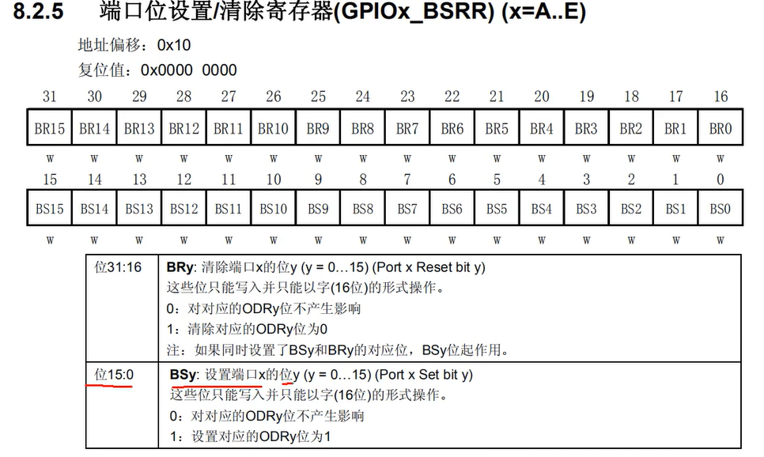
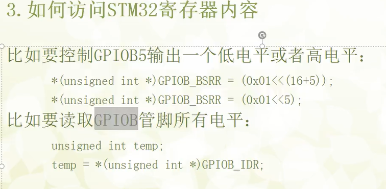

250511存储器与存储区映射

基地址为该区域的起始地址，偏移量指的是第二个区域相对于第一个区域的“距离”

端口位设置/清除寄存器(GPIOx_BSRR)
地址偏移:0x10

每一位下方的 w  代表该位可写,但无法读取到正确位
RW 代表可读可写

# 使用C封装寄存器
BSRR寄存器(BSRR = Bit Set/Reset Register（位设置/复位寄存器）)
它是 STM32 非常重要的寄存器，用来原子操作某一个 GPIO 引脚的电平。

写 1 有效，操作高位置0,操作低位置1,写 0 无效。
例如: 控制GPIOB5 输出高/低电平
*(unsigned int *)GPIOB_BSRR = (0x01<<(5))    // 输出1
*(unsigned int *)GPIOB_BSRR = (0x01<<(16+5)) // 输出0

 2. 这套封装是为了解决两个问题：
问题一：外设地址太长、太难记
比如 GPIOB 的控制寄存器实际地址是：

0x4000 1000（外设基地址）+ 0x0C00（GPIOB偏移）+ 0x00（寄存器偏移）
封装后你只要记住：

#define GPIOB_BASE (APB2PERIPH_BASE + 0x0C00)
#define GPIOB_CRL  *(unsigned int*)(GPIOB_BASE + 0x00)
更清晰、更可维护！

问题二：让 C 语言支持直接访问这些“硬编码地址”
由于 C 语言不能直接对某地址赋值，我们使用下面的技巧：

✅ 4. 为何使用 #define 而不是变量？
这类代码运行在嵌入式裸机环境下（无操作系统），一切都要做到极致轻量。使用 #define：

没有内存占用

编译期展开，效率最高

容易控制寄存器读写位置

✅ 5. 后期优化（结构体映射方式）
这种方式虽然直观，但随着项目复杂，后期开发常用更优雅的方式：

typedef struct {
    volatile uint32_t CRL;
    volatile uint32_t CRH;
    volatile uint32_t IDR;
    volatile uint32_t ODR;
    volatile uint32_t BSRR;
    volatile uint32_t BRR;
    volatile uint32_t LCKR;
} GPIO_TypeDef;

#define GPIOB ((GPIO_TypeDef *) GPIOB_BASE)
这样就可以写成：

GPIOB->ODR |= (1 << 5);  // 设置PB5输出高电平
更安全、易读，很多 HAL 库就是这么写的。

