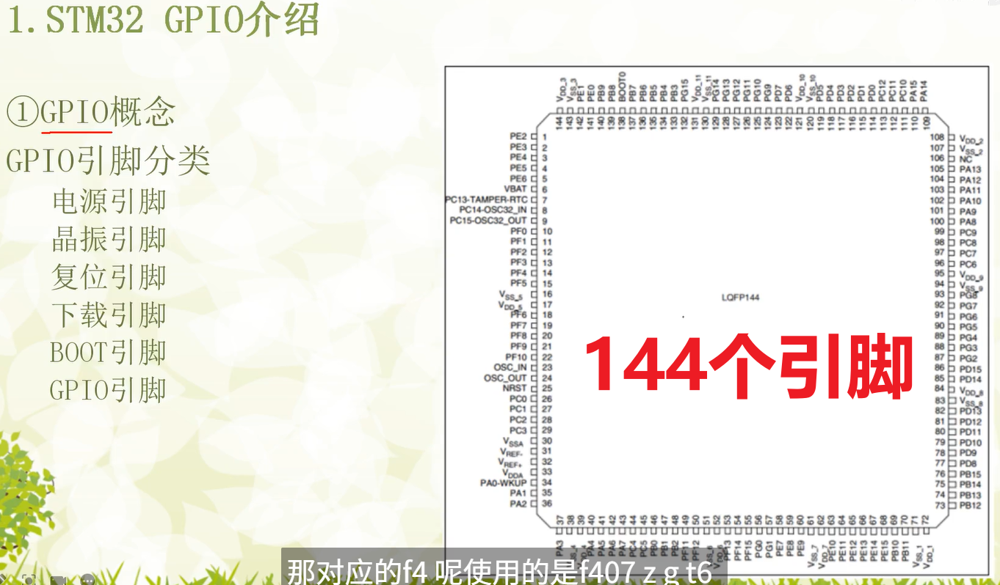
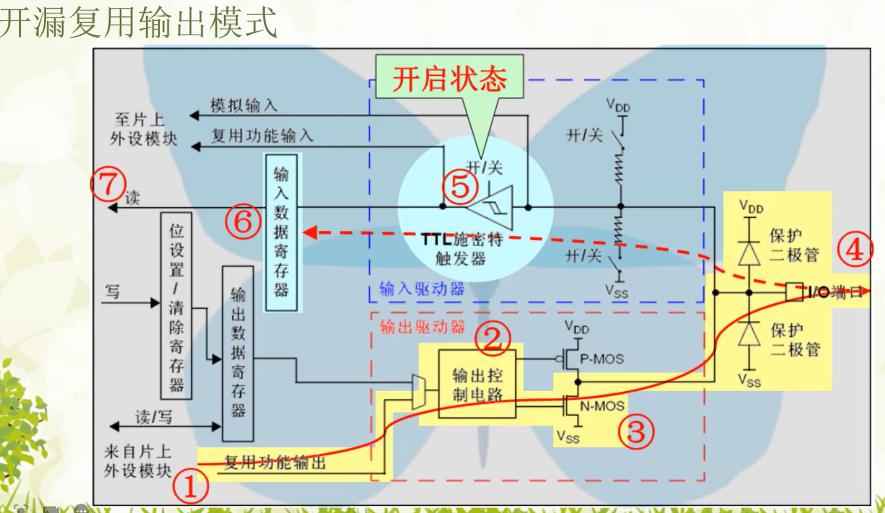

# 主要目的:
1.初始化系统时钟
2.使能对应GPIO时钟,并初始化GPIO
3.点亮LED(给对应引脚赋低电平)
LED0 - PF9
LED1 - PF10

## 第一步: 在<< STM32F407ZGT6数据手册.pdf >>中查找关键词 "Memory Map",找到寄存器基地址

## 第二步: 参考<<STM32F4xx中文参考手册.pdf>>补全STM32F407ZGT6的寄存器内容 例如F103: 
寄存器名称 (Register Name)	            寄存器地址 (Register Address)	相对于GPIOx基地址的偏移量 (Offset)
GPIOx_MODER (模式寄存器)	            0x40020400	                            0x00
GPIOx_OTYPER (输出类型寄存器)	        0x40020404	                            0x04
GPIOx_OSPEEDR (输出速度寄存器)	        0x40020408	                            0x08
GPIOx_PUPDR (上拉/下拉寄存器)	        0x4002040C	                            0x0C
GPIOx_IDR (输入数据寄存器)	            0x4020410	                            0x10
GPIOx_ODR (输出数据寄存器)	            0x4020414	                            0x14
GPIOx_BSRR (置位/复位寄存器)	        0x40020418	                            0x18
GPIOx_LCKR (锁定寄存器)                0x4002041C	                           0x1C
GPIOx_AFRL (复用功能低位寄存器)	        0x40020420	                            0x20
GPIOx_AFRH (复用功能高位寄存器)	        0x40020424	                            0x24

PERIPH_BASE
填写完为:
// ------------------------ 基础地址定义 ----------------------------

// 外设基地址（所有的外设地址空间起始于 0x40000000）
// 这是 STM32 的“外设总线”映射的起点
#define PERIPH_BASE      ((unsigned int)0x40000000)

// AHB1 总线基地址（GPIO、DMA、RCC 等都挂在 AHB1 上）
// AHB1 区间从 PERIPH_BASE 偏移 0x00020000 开始
#define AHB1PERIPH_BASE  (PERIPH_BASE + 0x00020000)

// ------------------------ GPIOF 寄存器地址 ----------------------------

// GPIOF 外设基地址（在 AHB1 总线上的偏移为 0x1400）
// 参考 STM32F4 手册可知 GPIOA~GPIOI 的基地址是依次递增的，每个间距 0x0400
#define GPIOF_BASE       (AHB1PERIPH_BASE + 0x1400)

// GPIOF 模式寄存器 MODER（偏移 0x00）
// 控制每个管脚的功能模式（00 输入，01 输出，10 复用，11 模拟）
#define GPIOF_MODER      *(unsigned int*)(GPIOF_BASE + 0x00)

// GPIOF 位操作寄存器 BSRR（偏移 0x18）
// 用于设置或清除某个 GPIO 输出引脚电平（写 1 有效，写 0 无效）
// 高 16 位清零（BRx），低 16 位置位（BSx）
#define GPIOF_BSRR       *(unsigned int*)(GPIOF_BASE + 0x18)

// ------------------------ RCC 寄存器地址 ----------------------------

// RCC（时钟控制）模块的基地址（在 AHB1 总线上，偏移 0x3800）
#define RCC_BASE         (AHB1PERIPH_BASE + 0x3800)

// RCC AHB1 外设时钟使能寄存器（偏移 0x30）
// 控制 GPIO、DMA 等模块的时钟开关（必须开启对应模块时钟才可以访问其寄存器）
#define RCC_AHB1ENR      *(unsigned int*)(RCC_BASE + 0x30)

	

### GPIOx_MODER (GPIO port mode register) 功能: 配置每个I/O引脚的工作模式。

使用方法:

这是一个32位寄存器，每2位控制一个引脚（Pin 0 ~ Pin 15）。
MODERy[1:0] 对应 PINy。例如，MODER0的位[1:0]控制Pin0，MODER1的位[3:2]控制Pin1，以此类推。
00: 输入模式 (Input) (复位后的默认状态)
01: 通用输出模式 (General purpose output mode)
10: 复用功能模式 (Alternate function mode) (用于SPI, I2C, UART等)
11: 模拟模式 (Analog mode) (用于ADC, DAC)
示例: 将GPIOB的Pin 5 (PB5) 设置为通用输出模式。
你需要将GPIOB_MODER寄存器的位[11:10]设置为01。
GPIOB->MODER &= ~(0x03 << (5 * 2)); // 清零位11和10
GPIOB->MODER |= (0x01 << (5 * 2));  // 设置为01

### GPIOx_OTYPER (GPIO port output type register) 功能: 当引脚配置为输出模式时，设置其输出类型。

使用方法:

这是一个32位寄存器，但只使用了低16位。每1位控制一个引脚。
OTy 对应 PINy。
0: 推挽输出 (Push-pull)。可以输出强高电平（VDD）和强低电平（VSS）。这是默认设置，也是最常用的。
1: 开漏输出 (Open-drain)。只能输出强低电平（VSS），高电平状态时引脚呈高阻态。需要外部上拉电阻才能输出高电平。常用于I2C等总线。
示例: 将PB5设置为开漏输出。
GPIOB->OTYPER |= (1 << 5);

### GPIOx_OSPEEDR (GPIO port output speed register) 功能: 当引脚配置为输出模式时，设置其输出速度（翻转速率）。

使用方法:

这是一个32位寄存器，每2位控制一个引脚。
OSPEEDRy[1:0] 对应 PINy。
00: 低速 (Low speed)
01: 中速 (Medium speed)
10: 高速 (High speed)
11: 非常高速 (Very high speed)
选择合适的速度有助于降低功耗和电磁干扰(EMI)。
示例: 将PB5设置为高速。
GPIOB->OSPEEDR &= ~(0x03 << (5 * 2)); // 清零
GPIOB->OSPEEDR |= (0x02 << (5 * 2));  // 设置为10

### GPIOx_PUPDR (GPIO port pull-up/pull-down register)功能: 配置引脚的内部上拉或下拉电阻。

使用方法:

这是一个32位寄存器，每2位控制一个引脚。
PUPDRy[1:0] 对应 PINy。
00: 浮空输入
01: 上拉 (Pull-up)
10: 下拉 (Pull-down)
11: 保留 (Reserved)
示例: 为作为输入的PB5启用内部上拉电阻。
GPIOB->PUPDR &= ~(0x03 << (5 * 2)); // 清零
GPIOB->PUPDR |= (0x01 << (5 * 2));  // 设置为01

### GPIOx_IDR (GPIO port input data register) 功能: 只读。用于读取I/O引脚的电平状态。

使用方法:

这是一个32位寄存器，低16位有效，每一位对应一个引脚。
IDRy 对应 PINy。
如果你读取 GPIOB_IDR 的第5位，得到1则表示PB5引脚是高电平，得到0则表示是低电平。
示例: 读取PB5的电平状态。
if (GPIOB->IDR & (1 << 5)) { ... } // 如果PB5为高电平

### GPIOx_ODR (GPIO port output data register)功能: 可读可写。用于设置或读取I/O引脚的输出电平。

使用方法:

这是一个32位寄存器，低16位有效，每一位对应一个引脚。
当引脚被配置为输出模式时，向 ODRy 位写1会使该引脚输出高电平，写0则输出低电平。
读取该寄存器可以知道你期望引脚输出的状态，而不是引脚实际的电平（实际电平请读取IDR）。
示例: 让PB5输出高电平。
GPIOB->ODR |= (1 << 5);
示例: 让PB5输出低电平。
GPIOB->ODR &= ~(1 << 5);

### GPIOx_BSRR (GPIO port bit set/reset register)功能: 只写。提供了一种原子操作的方式来置位（Set）或复位（Reset）引脚。

使用方法:

这是一个32位的寄存器。
低16位 (BSy, 位[15:0]): 对 BSy 写1会置位（Set）对应的ODRy位，即让 PINy 输出高电平。写0则无任何效果。
高16位 (BRy, 位[31:16]): 对 BRy 写1会复位（Reset）对应的ODRy位，即让 PINy 输出低电平。写0则无任何效果。
示例:

让PB5输出高电平: GPIOB->BSRR = (1 << 5); // 设置低16位的第5位
让PB5输出低电平: GPIOB->BSRR = (1 << (5 + 16)); // 设置高16位的第5位，即总的第21位
使用BSRR的好处是，你可以一次性操作多个引脚，而不会像读-改-写ODR那样可能在中断发生时产生竞态条件。
例如，GPIOB->BSRR = 0x00210003; 会将PB0和PB1置为高电平，同时将PB5置为低电平。

### GPIOx_LCKR (GPIO port configuration lock register)
功能: 锁定指定引脚的配置，直到下一次系统复位。一旦锁定，MODER, OTYPER, OSPEEDR, PUPDR, AFRL, AFRH 这些配置寄存器将无法被修改。
使用方法: 这是一个安全特性，防止程序意外修改重要的GPIO配置。操作过程比较特殊，需要一个特定的写序列来激活锁定。
向LCKR的LCKk[15:0]位写入你想锁定的引脚（写1）。
向LCKR的LCKK位（第16位）写入1。
向LCKK位写入0。
向LCKK位写入1。
读取LCKK位，确认锁定是否成功。 这个寄存器在常规开发中较少使用。

# 麒麟开发板GPIO介绍 
GPIO结构图

# 输入模式

# 输出模式

# 引脚类型分类
## 电源引脚
VCC（或 VDD）： 提供正电源（如 +5V、+3.3V）。
GND： 地线。

## 复位引脚
RESET（RST）： 高/低电平复位系统。

##  时钟引脚
XTAL1 / XTAL2（或 OSC_IN / OSC_OUT）： 接晶振，提供系统时钟。
有些单片机支持外部时钟输入或内部振荡器选择。

##  通用I/O引脚（GPIO）
可配置为 输入或输出。
一些单片机支持 复用功能（如串口、SPI、ADC、PWM等）。

#　输入状态（Input）
外部信号控制引脚电平，单片机读取。

高阻状态（High Impedance）：引脚内部无输出驱动，仅接收信号。

可配置：
上拉电阻（pull-up）
下拉电阻（pull-down）
模拟输入（供ADC使用）

#　输出状态（Output）
单片机驱动引脚电平控制外设。

分为：

推挽输出（Push-Pull）

开漏输出（Open-Drain/Open-Collector）

## 输入输出模式详解（以STM32为例）
    　模式	　　　　　　　　说明
    输入浮空	无上下拉，易受干扰，不推荐悬空引脚使用
    输入上拉	内部连接到VCC，通过上拉电阻固定状态
    输入下拉	内部连接到GND，通过下拉电阻固定状态
    模拟输入	用于ADC、DAC，禁用数字输入缓冲

    推挽输出	高低电平均可输出，驱动能力强，常用于LED、电平控制等
    开漏输出	只能下拉至低电平，常用于I²C、外部上拉到高电平场合
    
    复用输出	引脚由外设控制，如USART_TX、SPI_SCK 等
    复用推挽输出
    复用开漏输出 
    上下拉开关	某些单片机允许软件设置内部电阻是否启用

##　引脚电气特性
项目	说明
输入电压范围	最大/最小电压（通常为GND ~ VCC）
输出驱动能力	输出电流大小（如20mA、50mA），过载可能损坏引脚
上拉/下拉阻值	通常为几千欧姆（如10kΩ）
输入保护电路	有静电放电保护，过压保护器件

##　引脚使用注意事项
未使用引脚建议配置为输出低电平或输入上拉，避免悬空产生干扰。

避免引脚短路，输出高电平时不能直接连接GND。

IO口不能直接驱动大电流负载（如电机），需加三极管、MOS管或驱动芯片。

IO复用冲突要避免，确保同一引脚不被多个外设重复配置。

输入去抖动处理，如按键输入应软件/硬件去抖。

## 举例说明（基于STM32）
    // GPIOA 第5引脚配置为推挽输出
    GPIO_InitTypeDef GPIO_InitStruct = {0};
    __HAL_RCC_GPIOA_CLK_ENABLE();
    GPIO_InitStruct.Pin = GPIO_PIN_5;
    GPIO_InitStruct.Mode = GPIO_MODE_OUTPUT_PP;
    GPIO_InitStruct.Pull = GPIO_NOPULL;
    GPIO_InitStruct.Speed = GPIO_SPEED_FREQ_LOW;
    HAL_GPIO_Init(GPIOA, &GPIO_InitStruct);

    // 设置PA5输出高电平
    HAL_GPIO_WritePin(GPIOA, GPIO_PIN_5, GPIO_PIN_SET);

    // 设置PA5为输入模式，带上拉
    GPIO_InitStruct.Mode = GPIO_MODE_INPUT;
    GPIO_InitStruct.Pull = GPIO_PULLUP;
    HAL_GPIO_Init(GPIOA, &GPIO_InitStruct);
其他高级功能引脚（依据型号）
ADC（模拟输入）
PWM 输出
USART / UART（串口通信）
SPI / I2C 总线
外部中断输入（EXTI）
复用开漏输出（常用于I²C）

# 总结
特性	输入	输出
状态	高阻，带上下拉	推挽或开漏
控制	外部电平→内部读取	内部电平→驱动外部
应用场景	读取按钮、电压、外设信号等	控制LED、蜂鸣器、继电器等
注意事项	抗干扰、去抖、悬空处理	驱动能力、短路保护、电流限制

