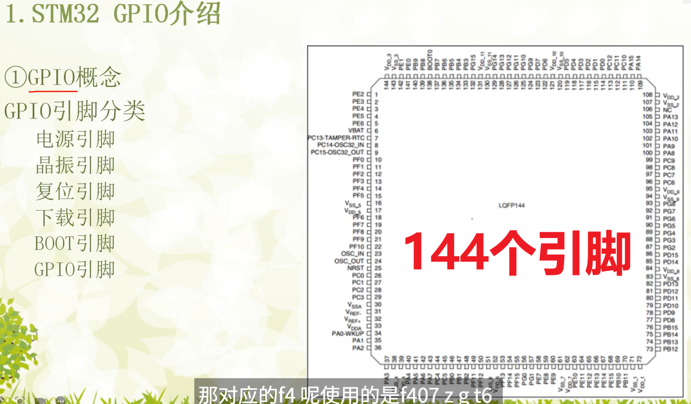
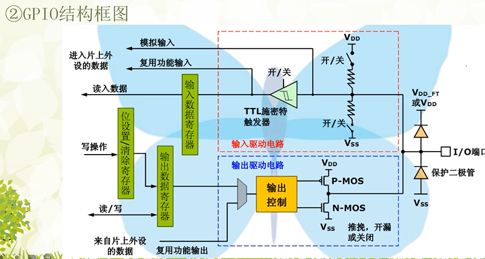
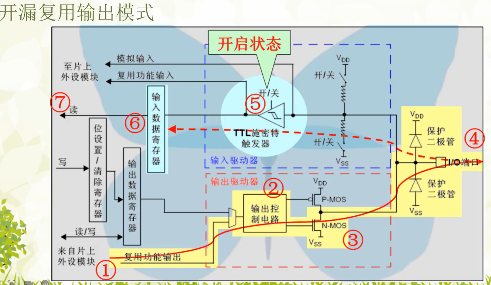

# 主要目的:
1.初始化系统时钟
2.使能对应GPIO时钟,并初始化GPIO
3.点亮LED(给对应引脚赋低电平)
LED0 - PF9
LED1 - PF10

## 第一步: 在<< STM32F407ZGT6数据手册.pdf >>中查找关键词 "Memory Map",找到寄存器基地址

# 麒麟开发板GPIO介绍 
GPIO结构图

# 输入模式

# 输出模式

# 引脚类型分类
## 电源引脚
VCC（或 VDD）： 提供正电源（如 +5V、+3.3V）。
GND： 地线。

## 复位引脚
RESET（RST）： 高/低电平复位系统。

##  时钟引脚
XTAL1 / XTAL2（或 OSC_IN / OSC_OUT）： 接晶振，提供系统时钟。
有些单片机支持外部时钟输入或内部振荡器选择。

##  通用I/O引脚（GPIO）
可配置为 输入或输出。
一些单片机支持 复用功能（如串口、SPI、ADC、PWM等）。

#　输入状态（Input）
外部信号控制引脚电平，单片机读取。

高阻状态（High Impedance）：引脚内部无输出驱动，仅接收信号。

可配置：
上拉电阻（pull-up）
下拉电阻（pull-down）
模拟输入（供ADC使用）

#　输出状态（Output）
单片机驱动引脚电平控制外设。

分为：

推挽输出（Push-Pull）

开漏输出（Open-Drain/Open-Collector）

## 输入输出模式详解（以STM32为例）
    　模式	　　　　　　　　说明
    输入浮空	无上下拉，易受干扰，不推荐悬空引脚使用
    输入上拉	内部连接到VCC，通过上拉电阻固定状态
    输入下拉	内部连接到GND，通过下拉电阻固定状态
    模拟输入	用于ADC、DAC，禁用数字输入缓冲

    推挽输出	高低电平均可输出，驱动能力强，常用于LED、电平控制等
    开漏输出	只能下拉至低电平，常用于I²C、外部上拉到高电平场合
    
    复用输出	引脚由外设控制，如USART_TX、SPI_SCK 等
    复用推挽输出
    复用开漏输出
    上下拉开关	某些单片机允许软件设置内部电阻是否启用

##　引脚电气特性
项目	说明
输入电压范围	最大/最小电压（通常为GND ~ VCC）
输出驱动能力	输出电流大小（如20mA、50mA），过载可能损坏引脚
上拉/下拉阻值	通常为几千欧姆（如10kΩ）
输入保护电路	有静电放电保护，过压保护器件

##　引脚使用注意事项
未使用引脚建议配置为输出低电平或输入上拉，避免悬空产生干扰。

避免引脚短路，输出高电平时不能直接连接GND。

IO口不能直接驱动大电流负载（如电机），需加三极管、MOS管或驱动芯片。

IO复用冲突要避免，确保同一引脚不被多个外设重复配置。

输入去抖动处理，如按键输入应软件/硬件去抖。

## 举例说明（基于STM32）
    // GPIOA 第5引脚配置为推挽输出
    GPIO_InitTypeDef GPIO_InitStruct = {0};
    __HAL_RCC_GPIOA_CLK_ENABLE();
    GPIO_InitStruct.Pin = GPIO_PIN_5;
    GPIO_InitStruct.Mode = GPIO_MODE_OUTPUT_PP;
    GPIO_InitStruct.Pull = GPIO_NOPULL;
    GPIO_InitStruct.Speed = GPIO_SPEED_FREQ_LOW;
    HAL_GPIO_Init(GPIOA, &GPIO_InitStruct);

    // 设置PA5输出高电平
    HAL_GPIO_WritePin(GPIOA, GPIO_PIN_5, GPIO_PIN_SET);

    // 设置PA5为输入模式，带上拉
    GPIO_InitStruct.Mode = GPIO_MODE_INPUT;
    GPIO_InitStruct.Pull = GPIO_PULLUP;
    HAL_GPIO_Init(GPIOA, &GPIO_InitStruct);
其他高级功能引脚（依据型号）
ADC（模拟输入）
PWM 输出
USART / UART（串口通信）
SPI / I2C 总线
外部中断输入（EXTI）
复用开漏输出（常用于I²C）

# 总结
特性	输入	输出
状态	高阻，带上下拉	推挽或开漏
控制	外部电平→内部读取	内部电平→驱动外部
应用场景	读取按钮、电压、外设信号等	控制LED、蜂鸣器、继电器等
注意事项	抗干扰、去抖、悬空处理	驱动能力、短路保护、电流限制

#　学到８．２，需要再次复习寄存器点灯的详细代码！

