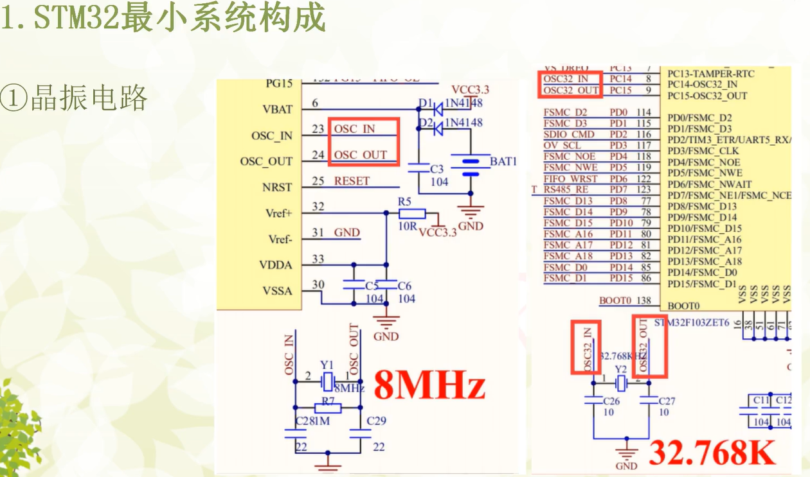
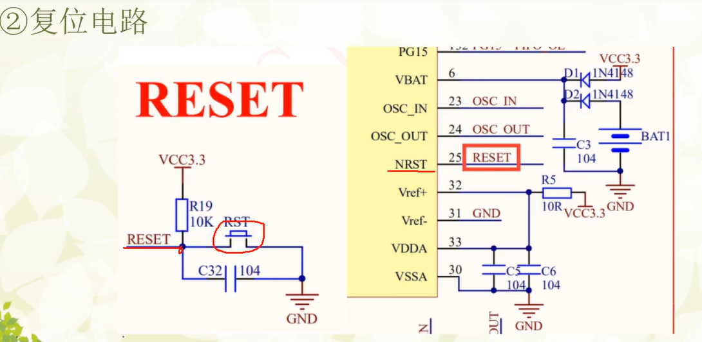
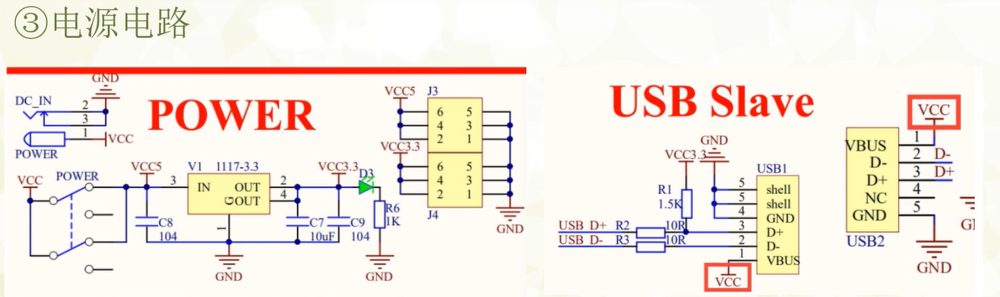
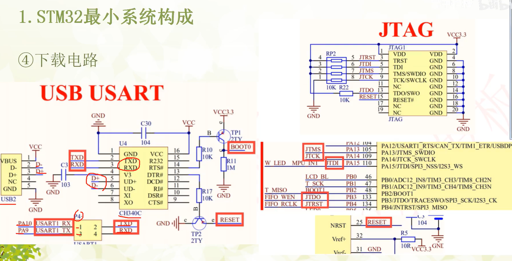
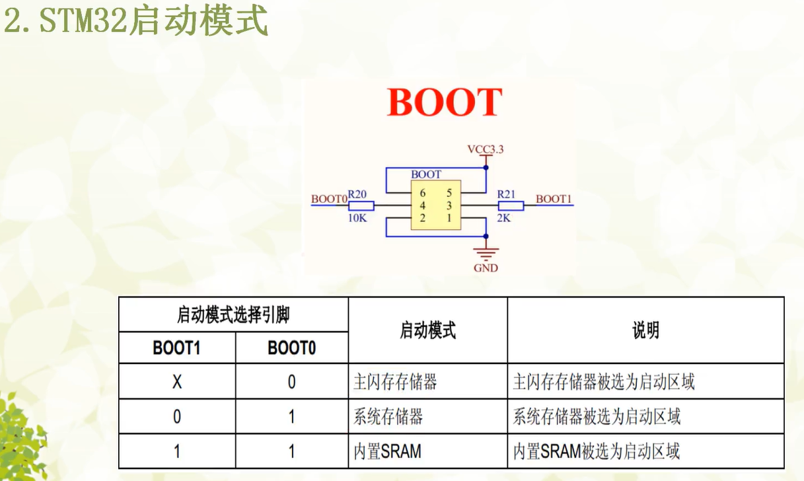

STM32最小系统的构成
STM32最小系统由以下部分组成：
# 晶振电路
# 复位电路
# 电源电路
# 下载电路

#　晶振电路
内部高速晶振
８MHZ
外部低速晶振
32．768KHZ

ＲＴＣ所用晶振
32．768KHZ

# 复位电路
reset 按钮按下给引脚输入低电平信号

# 电源电路
工作电压1.8~3.3V直流
ＰＯＷＥＲ　接口，直流５Ｖ输入，输出５Ｖ　ａｎｄ 3．3V，可以通过Ｊ３Ｊ４获取电压
但是如果通过

# 下载电路
ＳＷ下载方式／ＪＴＡＧ下载方式

# 以上电路图只是最小系统构成，但是不包括外部中断，外部中断是外部电路，所以STM32最小系统构成图中没有外部中断电路。

# ＳＴＭ３２启动模式（３种）
## 程序烧录步骤:
1.上位机软件向RTS发送低电平,此时为主存储器启动模式
2.程序下载完成,上位机软件向RTS发送高电平,此时为下载模式
3.上位机软件向RTS发送低电平,此时为下载模式

1 1 内置SRAM模式 内置SRAM被选为启动区域,一般用于调试
