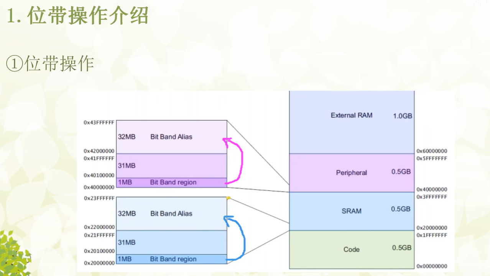
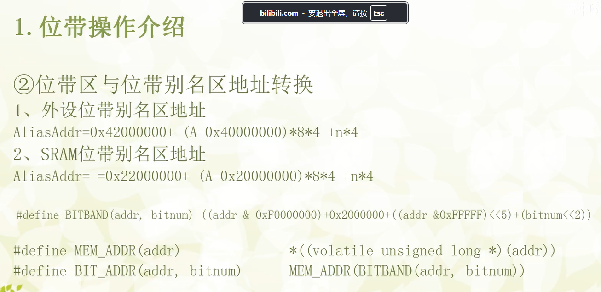

# 

# STM32位带(Bit-Band)操作详解 (以F407ZGT6为例)
1. 什么是位带操作 (Bit-Band)？
位带操作是ARM Cortex-M3/M4内核提供的一种特殊的内存映射机制。它允许我们将存储器中特定区域（称为“位带区”）的每一个比特（bit），都映射到另一个存储器区域（称为“位带别名区”）的一个**完整的字（word, 32位）**上。
简单来说，通过访问“位带别名区”的一个32位地址，我们就可以直接、独立地操作“位带区”中对应的某一个比特，而不会影响到它旁边的其他比特。
对于STM32F407ZGT6，内核定义了两个位带区域：
SRAM区：从 0x20000000 开始的1MB SRAM空间。
片上外设区 (Peripheral)：从 0x40000000 开始的1MB外设寄存器空间。

2. 为什么需要位带操作？—— 原子操作的重要性
在没有位带操作的情况下，要修改一个寄存器中的某一个比特（例如，设置某个GPIO引脚为高电平），我们通常需要三步：

读 (Read)：将整个寄存器的值读出来。
改 (Modify)：使用“或”运算 (|=) 或“与”运算 (&= ~) 来修改其中的某一位。
写 (Write)：将修改后的新值再写回寄存器。

这种“读-改-写”的操作在大多数情况下没有问题。但是，在有中断的系统中，它可能会被中断打断，从而导致竞态条件（Race Condition）和不可预料的错误。

举个例子：
假设主程序想设置GPIOA->ODR的第1位，而一个中断服务程序（ISR）想设置第2位。

主程序读取 GPIOA->ODR 的值,假设是0x0000。

此时，一个中断发生！

中断服务程序读取 GPIOA->ODR 的值（仍然是0x0000），将其第2位置1（0x0004），然后写回。此时GPIOA->ODR变为0x0004。

中断结束，主程序继续执行。它从中断前的状态（读到的值为0x0000）继续，将第1位置1（0x0002），然后写回。

最终结果：GPIOA->ODR 的值是0x0002。中断程序所做的修改被主程序“覆盖”了！

而位带操作是** “原子操作”（Atomic Operation） ** 。它通过一次内存访问（一条指令）就完成了对单个比特的读写，这个过程不会被中断打断。这从根本上解决了上述问题，保证了操作的实时性和可靠性，特别适用于多任务或中断频繁的应用。

3. 位带操作的原理
位带操作的核心是一个地址映射公式。通过这个公式，我们可以把位带区中某个字节的某个比特的地址，换算成位带别名区中对应的那个字的地址。

AliasAddr = AliasBase + (ByteOffset * 32) + (BitNumber * 4)

其中：

AliasAddr: 目标别名区的地址。

AliasBase: 别名区的基地址。

SRAM别名区基地址: 0x22000000

外设别名区基地址: 0x42000000

ByteOffset: 目标比特所在字节相对于其位带区基地址的偏移量。

ByteOffset = TargetAddr - BitBandBase

BitNumber: 目标比特在它所在字节中的位置（0-7）。

对 AliasAddr 地址进行写操作时：

如果写入的值的最低位（LSB）是 1，那么位带区对应的比特就会被 置1。

如果写入的值的最低位（LSB）是 0，那么位带区对应的比特就会被 清0。

4. 实例：使用位带操作控制GPIO (STM32F407ZGT6)
我们控制 PE4 引脚输出高低电平，实现LED闪烁。

第一步：定义宏简化操作

为了避免每次都手动计算复杂的地址，我们可以定义两个宏来自动完成这个过程。

// 把一个地址转换成它在位带别名区的地址
#define BITBAND_ADDR(addr, bitnum) ((addr & 0xF0000000) + 0x02000000 + ((addr & 0x00FFFFFF) << 5) + (bitnum << 2))

// 把一个指针转换成位带别名区的指针
#define ALIAS_REG(addr, bitnum) (*(volatile unsigned long *)(BITBAND_ADDR((unsigned long)addr, bitnum)))

BITBAND_ADDR 负责计算地址。

ALIAS_REG 负责将计算出的地址转换成一个可以直接操作的指针。

第二步：编写完整的示例代码

下面的代码演示了如何配置 PE4 为推挽输出，并在主循环中通过位带操作来翻转其电平。

// 6-LED闪烁（使用位带操作）\Public\system.h
#include "stm32f4xx.h"

//位带操作,实现类似51的IO口控制功能
//具体实现思想,参考<<CM3权威指南>>第五章(87页~92页).M4同M3类似,只是寄存器地址变了.
//IO口操作宏定义
#define BITBAND(addr, bitnum) ((addr & 0xF0000000)+0x2000000+((addr &0xFFFFF)<<5)+(bitnum<<2)) 
#define MEM_ADDR(addr)  *((volatile unsigned long  *)(addr)) 
#define BIT_ADDR(addr, bitnum)   MEM_ADDR(BITBAND(addr, bitnum)) 
//IO口地址映射
#define GPIOA_ODR_Addr    (GPIOA_BASE+20) //0x40020014
#define GPIOB_ODR_Addr    (GPIOB_BASE+20) //0x40020414 
#define GPIOC_ODR_Addr    (GPIOC_BASE+20) //0x40020814 
#define GPIOD_ODR_Addr    (GPIOD_BASE+20) //0x40020C14 
#define GPIOE_ODR_Addr    (GPIOE_BASE+20) //0x40021014 
#define GPIOF_ODR_Addr    (GPIOF_BASE+20) //0x40021414    
#define GPIOG_ODR_Addr    (GPIOG_BASE+20) //0x40021814   
#define GPIOH_ODR_Addr    (GPIOH_BASE+20) //0x40021C14    
#define GPIOI_ODR_Addr    (GPIOI_BASE+20) //0x40022014     

#define GPIOA_IDR_Addr    (GPIOA_BASE+16) //0x40020010 
#define GPIOB_IDR_Addr    (GPIOB_BASE+16) //0x40020410 
#define GPIOC_IDR_Addr    (GPIOC_BASE+16) //0x40020810 
#define GPIOD_IDR_Addr    (GPIOD_BASE+16) //0x40020C10 
#define GPIOE_IDR_Addr    (GPIOE_BASE+16) //0x40021010 
#define GPIOF_IDR_Addr    (GPIOF_BASE+16) //0x40021410 
#define GPIOG_IDR_Addr    (GPIOG_BASE+16) //0x40021810 
#define GPIOH_IDR_Addr    (GPIOH_BASE+16) //0x40021C10 
#define GPIOI_IDR_Addr    (GPIOI_BASE+16) //0x40022010 
 
//IO口操作,只对单一的IO口
//确保n的值小于16
#define PAout(n)   BIT_ADDR(GPIOA_ODR_Addr,n)  //输出 
#define PAin(n)    BIT_ADDR(GPIOA_IDR_Addr,n)  //输入 

#define PBout(n)   BIT_ADDR(GPIOB_ODR_Addr,n)  //输出 
#define PBin(n)    BIT_ADDR(GPIOB_IDR_Addr,n)  //输入 

#define PCout(n)   BIT_ADDR(GPIOC_ODR_Addr,n)  //输出 
#define PCin(n)    BIT_ADDR(GPIOC_IDR_Addr,n)  //输入 

#define PDout(n)   BIT_ADDR(GPIOD_ODR_Addr,n)  //输出 
#define PDin(n)    BIT_ADDR(GPIOD_IDR_Addr,n)  //输入 

#define PEout(n)   BIT_ADDR(GPIOE_ODR_Addr,n)  //输出 
#define PEin(n)    BIT_ADDR(GPIOE_IDR_Addr,n)  //输入

#define PFout(n)   BIT_ADDR(GPIOF_ODR_Addr,n)  //输出 
#define PFin(n)    BIT_ADDR(GPIOF_IDR_Addr,n)  //输入

#define PGout(n)   BIT_ADDR(GPIOG_ODR_Addr,n)  //输出 
#define PGin(n)    BIT_ADDR(GPIOG_IDR_Addr,n)  //输入

#define PHout(n)   BIT_ADDR(GPIOH_ODR_Addr,n)  //输出 
#define PHin(n)    BIT_ADDR(GPIOH_IDR_Addr,n)  //输入

#define PIout(n)   BIT_ADDR(GPIOI_ODR_Addr,n)  //输出 
#define PIin(n)    BIT_ADDR(GPIOI_IDR_Addr,n)  //输入

#endif

代码解析
使能时钟：任何外设的使用前提都是开启其时钟，位带操作也不例外。

配置GPIO：将PE4配置为基本的推挽输出模式。

核心操作：在主循环中，我们不再使用GPIOE->ODR |= ...这样的语句，而是直接对我们定义的宏PE4_OUT进行赋值。

PE4_OUT = 1; 编译后会变成一条单一的STR指令，直接将1写入 GPIOE->ODR 第4位对应的别名地址，从而将PE4设置为高电平。

PE4_OUT = 0; 同理，会将PE4设置为低电平。
这两个操作都是原子的。
