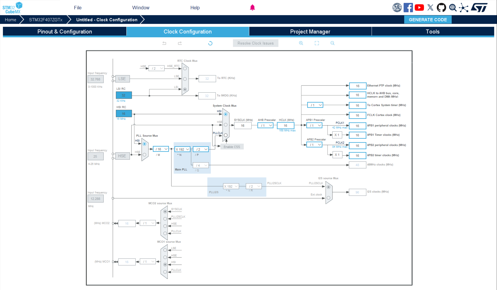
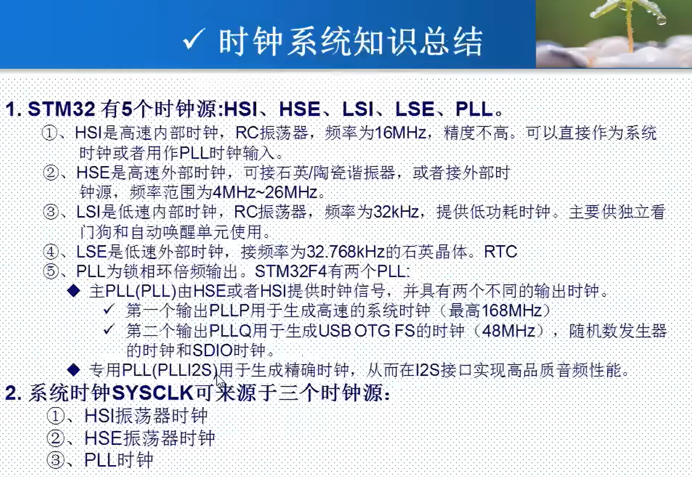
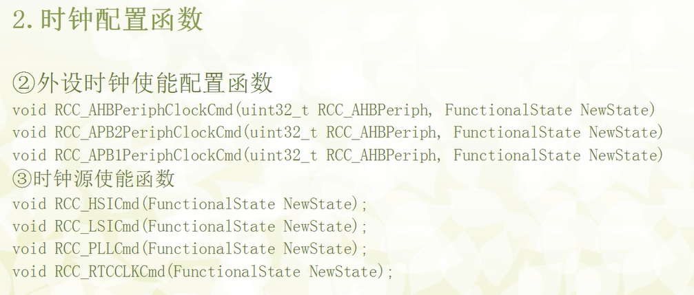
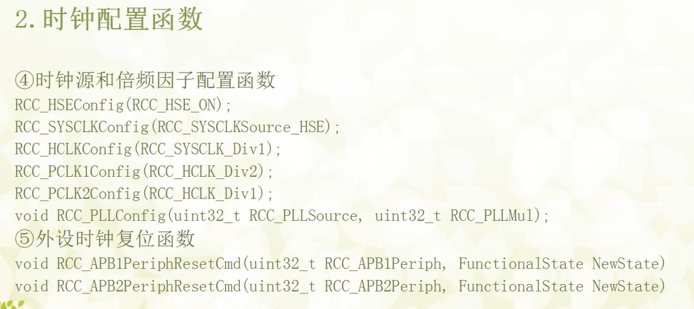
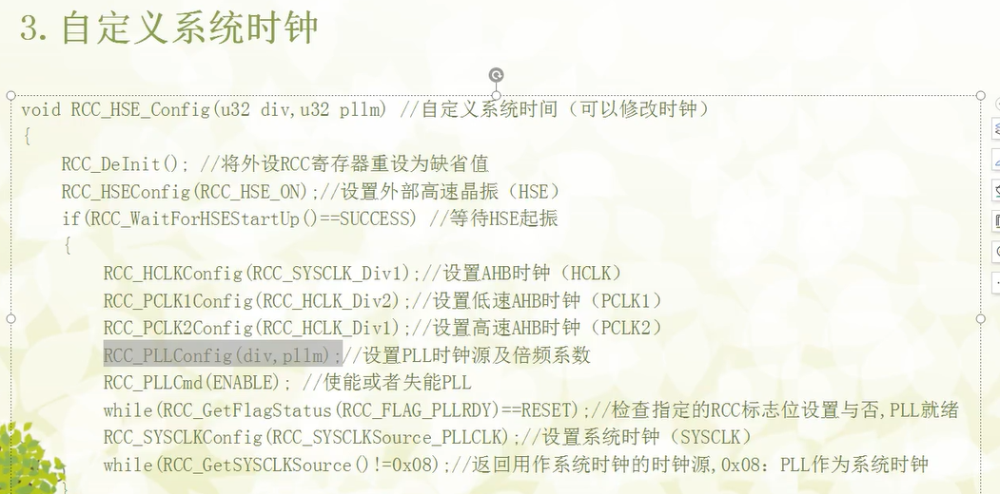

# 时钟树:

# STM32的五大时钟源:
- HSI (High-Speed Internal Clock) - 高速内部时钟
来源：由MCU内部的RC振荡器产生，频率固定为 16MHz。
特点：启动速度快，无需外部元件，成本低。但精度和稳定性相对较差，会受温度和电压变化影响。
用途：常作为MCU上电后的默认系统时钟，或在外部晶振（HSE）故障时作为备用时钟。

- HSE (High-Speed External Clock) - 高速外部时钟
来源：连接到MCU引脚的外部晶体/陶瓷谐振器。频率8MHz晶振。
特点：精度高，稳定性好，是获得高性能系统时钟的首选。
用途：通常作为主锁相环（PLL）的输入源，倍频后驱动系统时钟（SYSCLK）以达到MCU的最高工作频率168MHz。

- LSI (Low-Speed Internal Clock) - 低速内部时钟
来源：内部RC振荡器，频率大约为 32kHz。
特点：功耗极低。精度差，仅用于对精度要求不高的场景。
用途：主要用于驱动独立看门狗（IWDG）和作为RTC（实时时钟）的备用时钟。

- LSE (Low-Speed External Clock) - 低速外部时钟
来源：连接到MCU引脚的外部低频晶体，频率通常是精准的 32.768kHz。
特点：精度非常高，功耗低。
用途：RTC（实时时钟）的最佳时钟源。因为 2^(15) =32768，这个频率可以非常精确地分频得到1Hz的秒信号。

- PLL (Phase-Locked Loop) - 锁相环
来源：它本身不是一个独立的时钟源，而是一个频率倍频器。它可以选择HSI或HSE作为输入时钟。STM32F407拥有一个主PLL和两个专用PLL（PLLI2S和PLLSAI）。
特点：主PLL可以将一个相对较低的输入频率（如8MHz的HSE）倍频到一个很高的频率，为系统提供高达168MHz的主时钟，同时还能为USB OTG FS、SDIO等模块提供精确的48MHz时钟。
用途：为系统提供高速时钟，驱动CPU和高速外设。

- 时钟树的组成:
  - 时钟源: 时钟源可以是内部时钟,也可以是外部时钟
  - 时钟源的输出: 时钟源的输出可以是多个时钟源
  - 时钟源的输出的分频: 时钟源的输出可以被分频
- 时钟树的控制:
  - 时钟源的控制: 时钟源的控制可以是内部时钟,也可以是外部时钟
  - 时钟源的输出的控制: 时钟源的输出的控制可以是多个时钟源
  - 时钟源的输出的分频的控制: 时钟源的输出的分频的控制可以是多个时钟源

# 时钟配置函数

