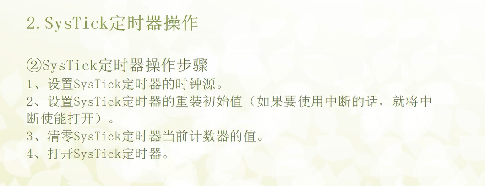

# SysTick，“System Tick Timer”，即系统节拍定时器。
它是集成在ARM Cortex-M3/M4/M7等内核中的一个24位倒计数定时器。你可以把它理解为CPU自带的一个小闹钟。

# SysTick的主要特点：
内核外设：它属于Cortex-M内核的一部分，而不是像TIM2、TIM3那样由芯片制造商（如ST）额外添加的外设。这意味着所有使用同款内核的MCU都拥有SysTick，具有良好的可移植性。

24位倒计数：它有一个24位的重装载寄存器（LOAD）和一个24位的当前计数值寄存器（VAL）。定时器启动后，VAL寄存器的值从LOAD寄存器中加载的值开始，每个时钟周期减1，直到减到0。

- 简单易用：相比通用的定时器（TIM），SysTick的配置非常简单，只涉及4个核心寄存器。

- 中断能力：当计数值从1减到0时，可以自动触发一次SysTick中断，同时硬件会自动重装载LOAD寄存器的值并开始下一次倒计数。这个特性使其成为RTOS（实时操作系统）理想的“心跳时钟”（OS Tick）。

- 时钟源灵活：SysTick的时钟源可以选择 AHB总线时钟（HCLK） 或是 AHB总线时钟的8分频（HCLK/8）。

# SysTick的四个核心寄存器：
## SysTick->CTRL (控制和状态寄存器)：

- ENABLE位：启动/停止SysTick定时器。

- TICKINT位：使能/禁止SysTick中断（当计到0时）。

- CLKSOURCE位：选择时钟源（0: HCLK/8, 1: HCLK）。

- COUNTFLAG位：计数溢出标志位。当计数到0时，此位由硬件置1。读取此位后会自动清零。

## SysTick->LOAD (重装载值寄存器)：

这是一个24位的寄存器。当定时器启动或计数到0时，VAL寄存器的值会从这里加载。

定时周期 = (LOAD + 1) * T_systick，其中T_systick是SysTick的时钟周期。

最大重装载值为 0x00FFFFFF。

## SysTick->VAL (当前值寄存器)：

这是一个24位的寄存器，只读。它存放着当前倒计数的计数值。

对它写任何值都会使其清零。

## SysTick->CALIB (校准值寄存器)：
只读寄存器，用于指示10ms的校准值，通常我们不直接使用它。

Delay_Us(u32 delaytime)实现过程

引入misc.c到工程,编写delay.c 和delay.h
// delay.h
#ifndef __DELAY_H
	#define __DELAY_H
	#include "misc.h"
	typedef unsigned long int	u64;
	typedef unsigned int		u32;
	typedef unsigned short int	u16;
	typedef unsigned char		u8;
	#define SYSCLK 168 //F407当前主频168MHz
	
	void Delay_Init(void); // 声明：这个函数叫Delay_Init，返回void，不带任何参数。
	void Delay_S(u8 delaytime);
	void Delay_Ms(u16 delaytime);
	void Delay_Us(u32 delaytime);
	
#endif

// delay.c
#include "delay.h"

static u8 fac_us =0;//静态存储“每微秒需要计多少次”

void Delay_Init(void)
{
	SysTick_CLKSourceConfig(SysTick_CLKSource_HCLK_Div8);	// 选择SysTick的时钟源为AHB总线时钟的1/8
	fac_us = SYSCLK / 8;//计算出 1 微秒要用多少个时钟周期
}

void Delay_Us(u32 delaytime)
{		
	u32 temp;	    	 
	SysTick->LOAD = delaytime * fac_us; // 时间加载	  		 
	SysTick->VAL = 0x00;        // 清空计数器
	SysTick->CTRL |= SysTick_CTRL_ENABLE_Msk; // 开始倒数 	 
	do
	{
		temp = SysTick->CTRL;
	} while ((temp & 0x01) && !(temp & (1 << 16))); // 等待时间到达   
	SysTick->CTRL &= ~SysTick_CTRL_ENABLE_Msk; // 关闭计数器
	SysTick->VAL = 0X00;       // 清空计数器	 
}

void Delay_Ms(u32 delaytime)
{
	while (delaytime--)
	{
		Delay_Us(1000);
	}
}

void Delay_S(u32 delaytime)
{
	while (delaytime--)
	{
		Delay_Ms(1000);
	}
}
