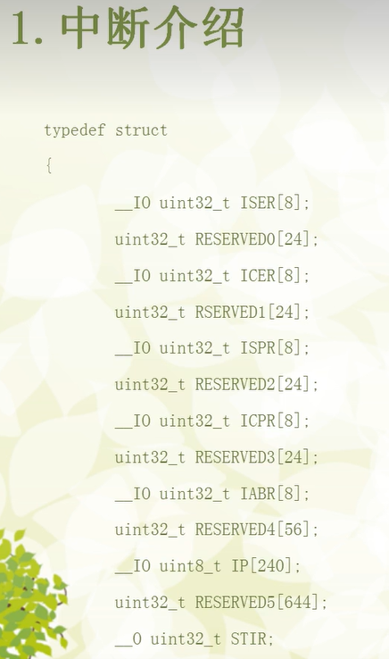
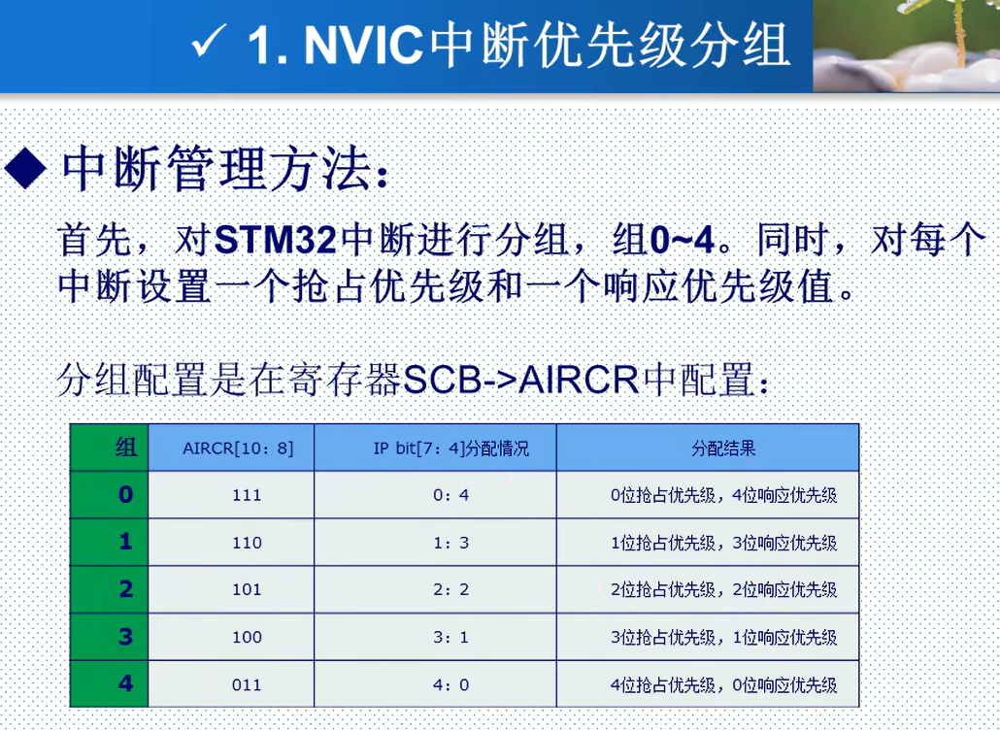
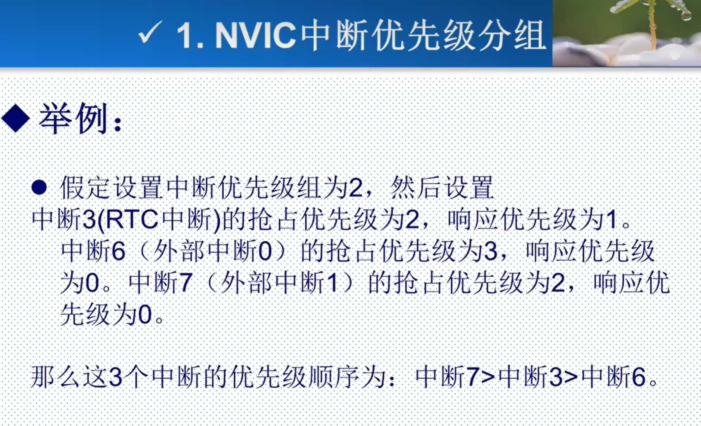
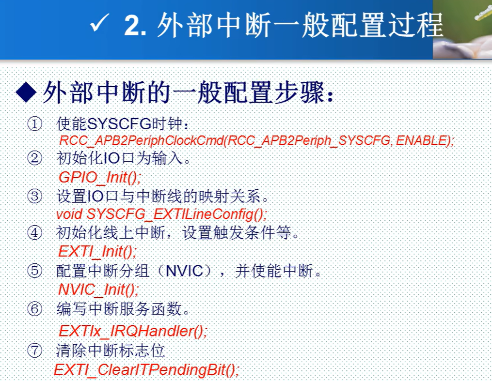
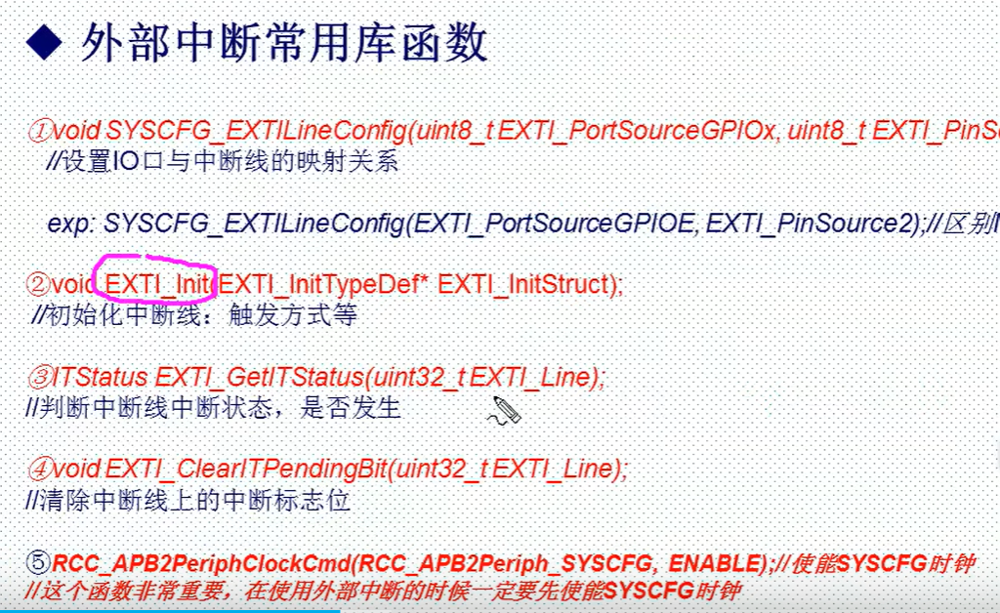

## NVIC 的核心寄存器，它们被封装在一个名为 NVIC_Type 的结构体中，方便通过C语言访问。
# 需要了解中断的含义 抢占优先级与响应优先级对于中断优先级的作用

__IO uint32_t ISER[8]; (Interrupt Set-Enable Registers - 中断使能设置寄存器)
ISER 是一个包含8个32位寄存器的数组。每个位对应一个中断通道。
为什么要这样写？ 往某个位写 '1'，就会使能 (Enable) 对应的中断。例如，要使能中断号为35的中断，就需要向 ISER[1] (因为 35/32 = 1) 的第3位 (35 % 32 = 3) 写1。写 '0' 则无效。这是硬件设计，只响应'1'的写入。

__IO uint32_t ICER[8]; (Interrupt Clear-Enable Registers - 中断使能清除寄存器)
与 ISER 相反。
为什么要这样写？ 往某个位写 '1'，就会失能 (Disable) 对应的中断。写 '0' 无效。

__IO uint32_t ISPR[8]; (Interrupt Set-Pending Registers - 中断挂起设置寄存器)
Pending 意为“挂起”或“悬而未决”。当一个中断事件发生但CPU正在处理其他事情时，这个中断就处于挂起状态。
为什么要这样写？ 往某个位写 '1'，可以手动触发一个中断（使其进入挂起状态），这在软件调试时非常有用。读取这个寄存器可以知道哪些中断正在等待处理。

__IO uint32_t ICPR[8]; (Interrupt Clear-Pending Registers - 中断挂起清除寄存器)
为什么要这样写？ 往某个位写 '1'，可以清除对应中断的挂起状态。通常，当CPU进入一个中断的ISR时，硬件会自动清除该中断的挂起位，但某些情况下也需要手动清除。

__IO uint32_t IABR[8]; (Interrupt Active Bit Registers - 中断激活状态寄存器)
这是一个只读寄存器。如果某个位是 '1'，表示CPU正在执行对应的中断服务程序。

uint32_t RESERVEDx[n];
为什么要这样写？ 这些是保留字段。硬件设计中，寄存器地址需要对齐，或者为未来扩展功能预留空间。程序员不应该读写这些保留地址，否则可能导致不可预知的行为。

__IO uint8_t IP[240]; (Interrupt Priority Registers - 中断优先级寄存器)
这个数组用来设置每个中断的优先级。STM32F4中，每个中断有8位用于设置优先级，但实际可用的位数由优先级分组配置决定。

 
1. 中断优先级 
   
   ## 特别说明:系统代码执行过程中只设置一次中断优先级分组,如果设置多次会导致优先级混乱

这是 NVIC 的一个核心概念，也是“嵌套 (Nested)”一词的由来。

抢占优先级 (Preemption Priority)：决定一个中断能否打断另一个正在执行的中断。**数值越小，优先级越高**。例如，一个抢占优先级为1的中断可以打断一个抢占优先级为2的ISR。
响应优先级 (Subpriority)：当两个或多个具有相同抢占优先级的中断同时发生时，响应优先级高的中断先被响应。**数值越小，优先级越高。**响应优先级不能导致中断嵌套。
通过配置中断优先级分组，可以将8位的优先级位分配给抢占优先级和子优先级。

1. 如何在 STM32F407 上配置和使用一个中断 (以外部中断 EXTI 为例)
假设我们想配置一个按键，当按键按下时，通过外部中断来执行某个任务（比如翻转LED灯）。

步骤一：硬件和时钟配置

使能按键所在GPIO端口的时钟（例如 RCC_AHB1PeriphClockCmd）。
使能 SYSCFG 的时钟，因为外部中断需要通过它来选择GPIO引脚。
配置GPIO引脚为输入模式。
步骤二：配置 EXTI (外部中断/事件控制器)

将GPIO引脚连接到对应的EXTI线。例如，将 PA0 连接到 EXTI_Line0。
配置EXTI线：选择中断模式、触发方式（上升沿、下降沿或双边沿触发）。
步骤三：配置 NVIC (使用我们上面讨论的寄存器)

这一步通常通过库函数完成，但其底层就是在操作 ISER, IP 等寄存器。

设置中断优先级：配置该EXTI线的中断抢占优先级和子优先级。
使能中断通道：在NVIC中使能该EXTI线对应的中断通道。这会向 ISER 寄存器的相应位写1。
步骤四：编写中断服务程序 (ISR)

在 stm32f4xx_it.c 文件中，找到或创建一个与您配置的EXTI线对应的中断处理函数。例如，EXTI0_IRQHandler 用于处理 EXTI_Line0 上的中断。
在函数内部：
检查中断标志位：首先必须检查是哪个中断源触发了中断。
执行您的任务：例如，翻转LED灯。
清除中断标志位：这是至关重要的一步！如果不清除中断标志位，CPU在退出ISR后会认为中断仍然存在，从而立即再次进入同一个ISR，导致程序卡死。

# 配置过程 

// 正点原子中断按钮实现方式
// exit.h
#ifndef __EXTI_H
#define __EXTI_H

#include "./SYSTEM/sys/sys.h"

/******************************************************************************************/
/* 引脚 和 中断编号 & 中断服务函数 定义 */ 

#define KEY0_INT_GPIO_PORT              GPIOE
#define KEY0_INT_GPIO_PIN               SYS_GPIO_PIN4
#define KEY0_INT_GPIO_CLK_ENABLE()      do{ RCC->AHB1ENR |= 1 << 4; }while(0)   /* PE口时钟使能 */
#define KEY0_INT_IRQn                   EXTI4_IRQn
#define KEY0_INT_IRQHandler             EXTI4_IRQHandler

#define KEY1_INT_GPIO_PORT              GPIOE
#define KEY1_INT_GPIO_PIN               SYS_GPIO_PIN3
#define KEY1_INT_GPIO_CLK_ENABLE()      do{ RCC->AHB1ENR |= 1 << 4; }while(0)   /* PE口时钟使能 */
#define KEY1_INT_IRQn                   EXTI3_IRQn
#define KEY1_INT_IRQHandler             EXTI3_IRQHandler

#define KEY2_INT_GPIO_PORT              GPIOE
#define KEY2_INT_GPIO_PIN               SYS_GPIO_PIN2
#define KEY2_INT_GPIO_CLK_ENABLE()      do{ RCC->AHB1ENR |= 1 << 4; }while(0)   /* PE口时钟使能 */
#define KEY2_INT_IRQn                   EXTI2_IRQn
#define KEY2_INT_IRQHandler             EXTI2_IRQHandler

#define WKUP_INT_GPIO_PORT              GPIOA
#define WKUP_INT_GPIO_PIN               SYS_GPIO_PIN0
#define WKUP_INT_GPIO_CLK_ENABLE()      do{ RCC->AHB1ENR |= 1 << 0; }while(0)   /* PA口时钟使能 */
#define WKUP_INT_IRQn                   EXTI0_IRQn
#define WKUP_INT_IRQHandler             EXTI0_IRQHandler

/******************************************************************************************/

void extix_init(void);  /* 外部中断初始化 */

#endif

// exit.c
#include "./SYSTEM/sys/sys.h"
#include "./SYSTEM/delay/delay.h"
#include "./BSP/LED/led.h"
#include "./BSP/BEEP/beep.h"
#include "./BSP/KEY/key.h"
#include "./BSP/EXTI/exti.h"

/**
 * @brief       KEY0 外部中断服务程序
 * @param       无
 * @retval      无
 */
void KEY0_INT_IRQHandler(void)
{
    delay_ms(20);                   /* 消抖 */
    EXTI->PR = KEY0_INT_GPIO_PIN;   /* 清除KEY0所在中断线 的中断标志位 */

    if (KEY0 == 0)
    {
        LED0_TOGGLE();              /* LED0 状态取反 */ 
    }
}

/**
 * @brief       KEY1 外部中断服务程序
 * @param       无
 * @retval      无
 */
void KEY1_INT_IRQHandler(void)
{ 
    delay_ms(20);                   /* 消抖 */
    EXTI->PR = KEY1_INT_GPIO_PIN;   /* 清除KEY1所在中断线 的中断标志位 */

    if (KEY1 == 0)
    {
        LED1_TOGGLE();              /* LED1 状态取反 */ 
    }
}

/**
 * @brief       KEY2 外部中断服务程序
 * @param       无
 * @retval      无
 */
void KEY2_INT_IRQHandler(void)
{
    delay_ms(20);                   /* 消抖 */
    EXTI->PR = KEY2_INT_GPIO_PIN;   /* 清除KEY2所在中断线 的中断标志位 */

    if (KEY2 == 0)
    {
        LED1_TOGGLE();              /* LED1 状态取反 */ 
        LED0_TOGGLE();              /* LED0 状态取反 */ 
    }
}

/**
 * @brief       WK_UP 外部中断服务程序
 * @param       无
 * @retval      无
 */
void WKUP_INT_IRQHandler(void)
{ 
    delay_ms(20);                   /* 消抖 */
    EXTI->PR = WKUP_INT_GPIO_PIN;   /* 清除WKUP所在中断线 的中断标志位 */

    if (WK_UP == 1)
    {
        BEEP_TOGGLE();              /* LED2 状态取反 */ 
    }
}

/**
 * @brief       外部中断初始化程序
 * @param       无
 * @retval      无
 */
void extix_init(void)
{
    key_init();
    sys_nvic_ex_config(KEY0_INT_GPIO_PORT, KEY0_INT_GPIO_PIN, SYS_GPIO_FTIR);   /* KEY0配置为下降沿触发中断 */
    sys_nvic_ex_config(KEY1_INT_GPIO_PORT, KEY1_INT_GPIO_PIN, SYS_GPIO_FTIR);   /* KEY1配置为下降沿触发中断 */
    sys_nvic_ex_config(KEY2_INT_GPIO_PORT, KEY2_INT_GPIO_PIN, SYS_GPIO_FTIR);   /* KEY2配置为下降沿触发中断 */
    sys_nvic_ex_config(WKUP_INT_GPIO_PORT, WKUP_INT_GPIO_PIN, SYS_GPIO_RTIR);   /* WKUP配置为上升沿触发中断 */

    sys_nvic_init( 0, 2, KEY0_INT_IRQn, 2); /* 抢占0，子优先级2，组2 */
    sys_nvic_init( 1, 2, KEY1_INT_IRQn, 2); /* 抢占1，子优先级2，组2 */
    sys_nvic_init( 2, 2, KEY2_INT_IRQn, 2); /* 抢占2，子优先级2，组2 */
    sys_nvic_init( 3, 2, WKUP_INT_IRQn, 2); /* 抢占3，子优先级2，组2 */

}

