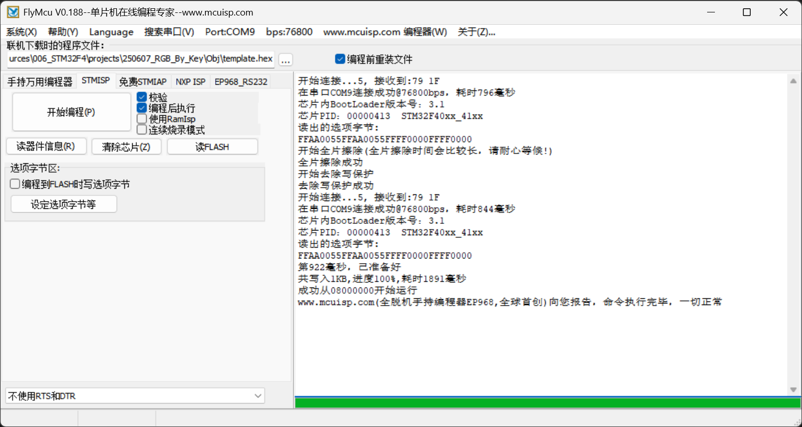

## 该方式需要反复插拔跳线帽, 过程复杂, 故仍旧采用普中科技自带的烧录方法。

手动强制芯片进入烧录模式。这才是最可靠的方法。

请严格按照以下步骤操作：

断开连接：

拔掉连接开发板和电脑的 USB 数据线，让开发板完全断电。
设置启动跳线：

在您的麒麟 F407 开发板上找到 BOOT0 和 BOOT1 的跳线帽。
将 BOOT0 的跳线帽插到 1 的位置（高电平）。
将 BOOT1 的跳线帽插到 0 的位置（低电平）。
总结：设置为 BOOT0 = 1, BOOT1 = 0。
修改 FlyMCU 设置：

在 FlyMCU 软件界面中，取消勾选左侧的 "DTR低电平复位,RTS高电平进BootLoader" 选项。
这一步至关重要，因为我们已经手动设置了，不再需要软件去自动控制。
连接并烧录：

将设置好跳线帽的开发板用 USB 线重新连接到电脑。
连接后，按一下开发板上的复位（RESET）按键，然后松开。
在 FlyMCU 中选择正确的 COM 端口和波特率，然后点击“开始编程(P)”。
此时，软件应该就能成功连接并开始擦除和烧录程序了。
恢复正常模式：

程序烧录成功后，务必再次断开开发板的 USB 连接。
将 BOOT0 的跳线帽插回到 0 的位置。
这样设置（BOOT0=0, BOOT1=0）是为了让芯片从内部 Flash 启动，也就是运行您刚刚烧录进去的程序。
恢复好跳线后，再重新连接 USB，您的程序就会正常运行了。

总结一下：您的板子具备自动下载功能，但它没能正常工作。因此，您需要通过手动设置 BOOT0 和 BOOT1 跳线，并取消 FlyMCU 里的自动控制选项，来强制芯片进入下载模式，从而完成程序烧录。
