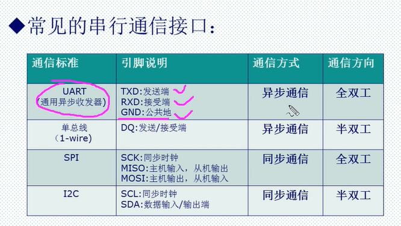
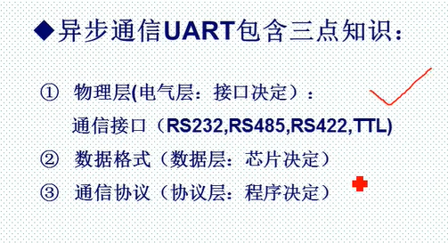
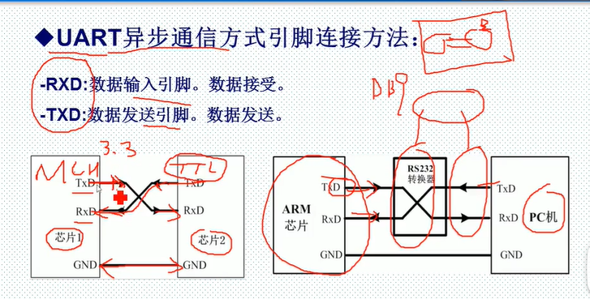
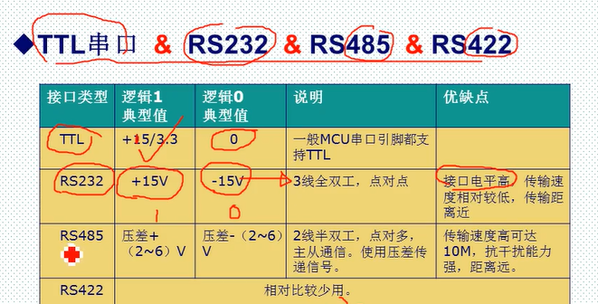
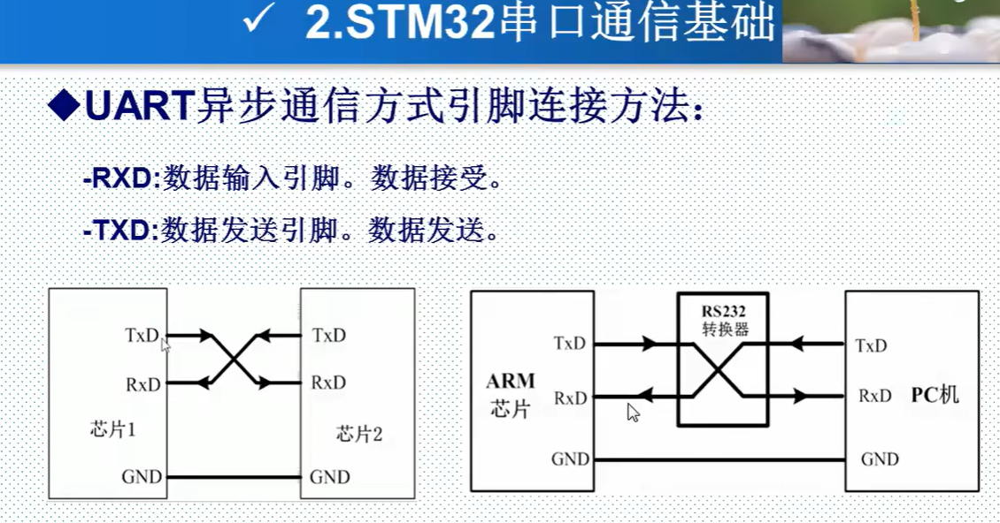

并行通信： 同时 通过多条物理线路（通道） 传输数据的多个位（比特）。想象成一条宽阔的多车道高速公路，多辆车（比特）可以并行行驶。

串行通信： 依次 通过一条（或少数几条）物理线路（通道） 传输数据的单个位（比特）。想象成一条单车道公路，车辆（比特）必须排成单列依次通过。

**UART是通信方式，TTL RS232 RS485是接口**

一、 并行通信
原理:

发送端将需要传输的数据（通常是一个字节，如8位）的每一位（bit）分别分配到独立的物理传输线（数据线）上。
同时还需要至少一条控制线（如时钟线、选通线）来协调发送端和接收端的同步。
在控制信号（通常是时钟脉冲的上升沿或下降沿，或者选通信号有效时）的作用下，发送端同时将所有位线上的电平（代表0或1）驱动到对应的数据线上。
接收端在相同的控制信号作用下，同时从所有数据线上读取电平状态，从而还原出发送端发送的那个完整数据字（如一个字节）。
关键点： 多位数据在同一时刻通过多条物理线路传输。

优点:

理论速度高： 在相同时钟频率下，一次传输多位数据，理论上数据吞吐率比串行高（例如，8位并行一次传8位，8位串行需要8个时钟周期）。
结构相对简单（早期观点）： 对于短距离、低速应用，逻辑控制相对直观。

缺点:

成本高： 需要大量物理线路（数据线 + 控制线）。线缆、连接器都更复杂、昂贵。
布线复杂： 多根线并行走线，在电路板或线缆中占用空间大，容易引起信号串扰（Crosstalk）。

时钟偏移（Skew）： 这是并行通信的致命弱点。由于物理线路长度、电气特性的微小差异，以及环境干扰，同一时刻从发送端发出的信号，到达接收端的时间会略有不同。随着传输频率提高或距离增加，这种偏移会变得严重，导致接收端无法在同一时钟沿准确采样所有位线，产生错误。严重限制了高速和长距离传输能力。

抗干扰能力较弱： 多根线紧密排列，容易相互干扰（串扰），也容易受到外部电磁干扰影响。
同步要求高： 需要精确的时钟或选通信号来保证发送和接收的严格同步。

二、 串行通信
原理:

发送端将需要传输的数据（可以是一个字节，也可以是更长的数据块）拆分成单个的位（bit）。

这些位按照一定的顺序（通常是从最低有效位 LSB 或最高有效位 MSB 开始）依次在一条物理线路（或一对差分线） 上发送出去。

接收端需要从连续的比特流中识别出每个位的起始和结束，并将它们重新组装成完整的数据字节或数据块。

关键点： 多位数据在不同时刻通过一条（或少数几条）物理线路传输。时间换空间。

优点:

成本低： 所需物理线路极少（通常 1-4 根线：数据线、地线、有时需要时钟线或一对差分线）。线缆、连接器简单小巧、便宜。
布线简单： 占用空间小，易于在电路板布线或长距离敷设线缆（如网线、光纤）。
抗干扰能力强： 特别是采用差分信号传输的串行标准（如 RS-485, USB, SATA, PCIe）。差分信号用两根线传输相位相反的信号，接收端检测两者电压差。外部共模干扰对两根线的影响几乎相同，电压差变化很小，被有效抑制。单端信号（如 RS-232）抗干扰弱于差分，但比并行布线受串扰影响小得多。
适合高速长距离传输： 由于线路少，时钟偏移问题大大减轻或消除（尤其在差分传输中）。通过提高单条通道的传输速率（时钟频率），并采用更高效的编码方式（如 8b/10b, 64b/66b）和预加重/均衡技术，现代串行通信可以轻松达到 Gbps 甚至数十 Gbps 的速率，远非并行可比。光纤的使用更是实现了超长距离高速传输。

可扩展性好： 可以通过增加通道（Lanes）实现更高带宽（如 PCIe x1, x4, x16）。

缺点:

协议相对复杂： 需要解决比特同步（识别每个位的开始和结束）、字节/帧同步（识别数据块的边界）、错误检测/纠正等问题。需要专门的串行通信控制器来处理复杂的编解码和时序。

理论单通道速率要求高： 要达到与并行接口相同的总数据率，其单条通道的工作频率必须远高于并行接口的单条通道频率（例如，8位并行在 100MHz 时钟下理论带宽为 800Mbps；单通道串行要达到 800Mbps，其信号速率至少需要 800Mbps，考虑编码开销可能需要更高）。

常见应用举例:

USB (通用串行总线): 现代计算机与外围设备（键盘、鼠标、U盘、打印机、手机等）连接的主流接口。使用差分信号（D+, D-）进行高速串行通信。版本从 USB 1.0 (1.5/12 Mbps) 发展到 USB4 (40 Gbps)。

SATA (串行ATA): 取代 PATA/IDE 成为连接硬盘（HDD/SSD）、光驱的标准接口。使用差分信号对进行高速点对点串行传输。速度远超老式并行 IDE。

PCI Express (PCIe): 现代计算机内部的高速扩展总线标准，用于连接显卡、SSD（NVMe）、高速网卡等。采用高速串行差分信号对（Lanes），通过增加 Lane 的数量（x1, x4, x8, x16）来线性提升带宽。是克服并行总线（PCI, AGP）时钟偏移瓶颈的典范。

以太网 (Ethernet): 局域网和广域网的基础。无论是古老的 10BASE-T (10 Mbps) 还是现代的 1000BASE-T (1 Gbps), 10GBASE-T (10 Gbps)，其物理层传输的本质都是在双绞线（或光纤）上进行串行数据传输（通常使用多对线同时进行全双工串行传输）。

RS-232  / RS-485: 经典的工业控制、设备调试串行通信标准。RS-232 是单端信号，常用于短距离（<15m）计算机与调制解调器、早期鼠标/终端连接。RS-485 使用差分信号，支持多点通信和更长距离（>1000m），广泛应用于工业现场总线。

I²C (Inter-Integrated Circuit): 一种用于板级器件（如传感器、EEPROM、RTC 时钟）间通信的低速串行总线。只需要两条线：串行数据线 (SDA) 和串行时钟线 (SCL)。支持多主多从。

SPI (Serial Peripheral Interface): 另一种常用的板级高速串行通信协议。需要四条线：主出从入 (MOSI)、主入从出 (MISO)、时钟 (SCLK)、片选 (SS/CS)。支持全双工通信。

CAN (Controller Area Network): 汽车电子和工业自动化中广泛使用的可靠串行通信总线协议，基于差分信号，具有优秀的抗干扰和错误处理能力。

三、 并行通信 vs 串行通信 对比总结
 特性	        并行通信                	            串行通信

传输方式	同时传输多个位（多位并行）	    依次传输单个位
物理线路	多条数据线（+控制线）	        一条或少数几条数据线
核心问题	时钟偏移 限制速度与距离	        比特/字节同步，协议复杂度
速度潜力	受限于偏移，难以高速	        可高速（GHz级单通道），通过多通道扩展
传输距离	短距离（通常< 1米，高速时更短）	长距离（可达千米以上，尤其差分/光纤）
  成本      高（线多，连接器复杂）	        低（线少，连接器小巧）
布线复杂度	高（宽线缆，易串扰）	        低（细线缆，空间占用小）
抗干扰性	弱（易串扰和外部干扰）	        强（尤其差分传输，抗共模干扰）
典型应用	老式打印机 老式硬盘 早期总线	USB、SATA、PCIe、以太网、RS-232/RS-485、I²C、SPI、CAN

