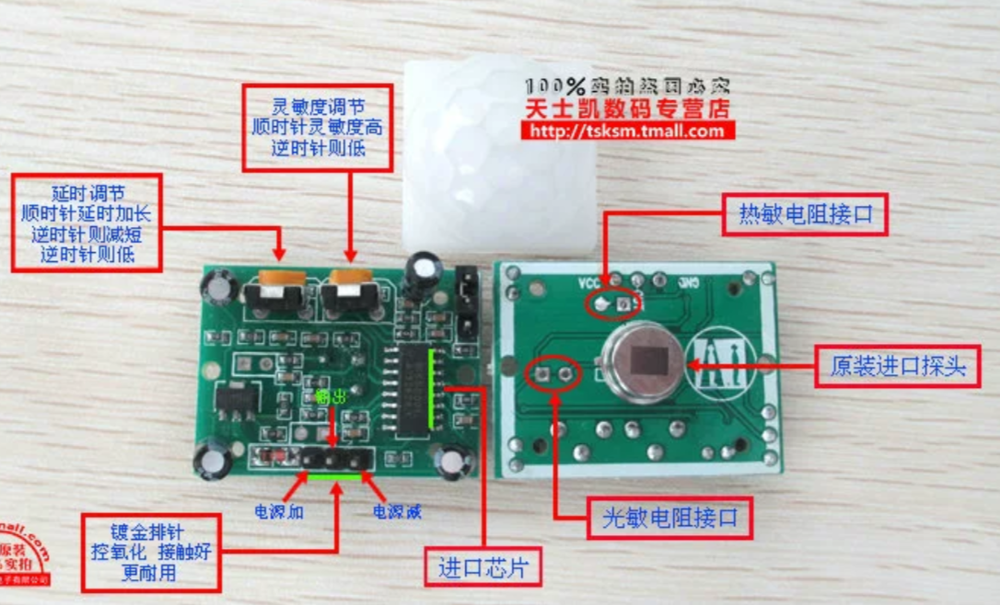

VCC,GND,OUT引脚标识拔下外壳可见

元件平放在桌面,半球朝上,正面两个旋钮,其中

**左侧旋钮用于控制电平持续时间长短**
**右侧旋钮用于控制触发距离远近**

**跳线帽用于控制触发时,OUT引脚对外输出高电平还是低电平**
L不可重复，H可重复。可跳线选择，默认为H。
    A.不可重复触发方式：即感应输出高电平后，延时时间一结束，输出将自动从高电平变为低电平。
    B.可重复触发方式：  即感应输出高电平后，在延时时间段内，如果有人体在其感应范围内活动，其输出将一直保持高电平，直到人离开后才延时将高电平变为低电平(感应模块检测到人 体的每一次活动后会自动顺延一个延时时间段，并且以最后一次活动的时间为延时时间的起始点)。

感应模块采用双元探头， 探头的窗口为长方形， 双元（ A 元 B 元）位于较长方向的两
端，当人体从左到右或从右到左走过时,红外光谱到达双元的时间、距离有差值，差值越
大， 感应越灵敏， 当人体从正面走向探头或从上到下或从下到上方向走过时， 双元检测不
到红外光谱距离的变化， 无差值， 因此感应不灵敏或不工作;
所以安装感应器时应使探头双元的方向与人体活动最多的方向尽量相平行，保证人体经过时先后被探头双元所感应。
为了增加感应角度范围， 本模块采用圆形透镜， 也使得探头四面都感应， 但左右两侧仍然
比上下两个方向感应范围大、灵敏度强，安装时仍须尽量按以上要求。

