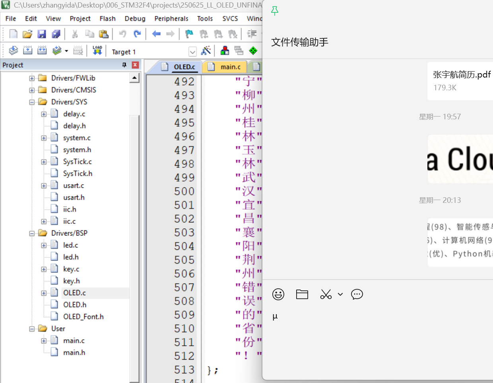
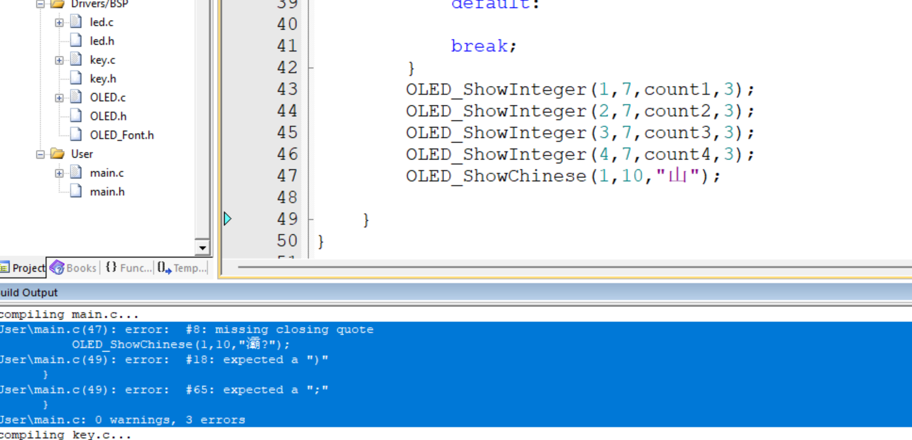
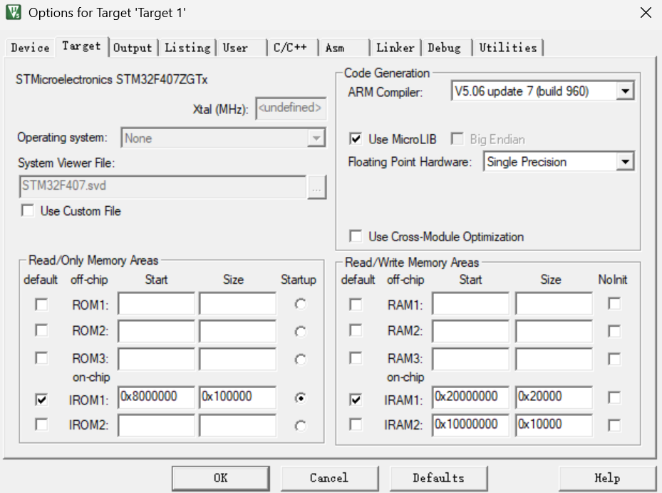
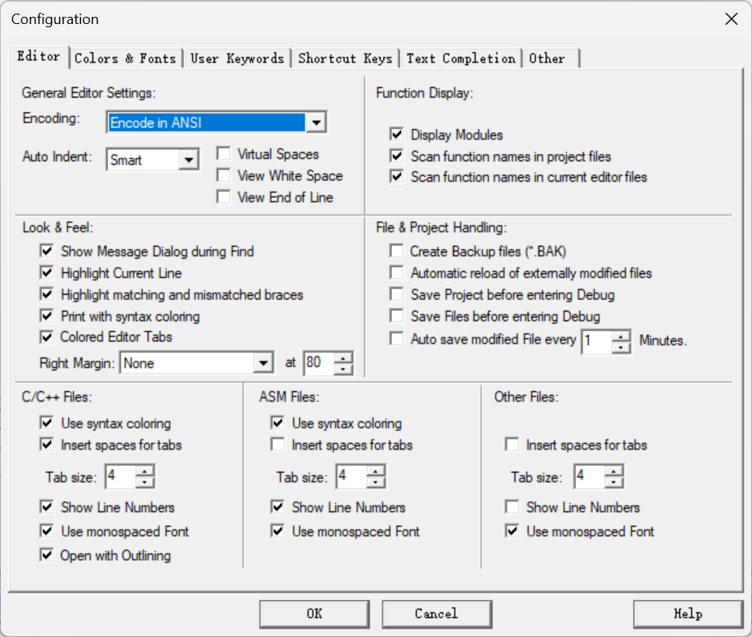

如果遇到
那么请参考以下步骤：
1. 检查MDK5的设置,
2. 最简单的方法:**将记事本里正确的内容复制,粘贴到keil编译器里**
3. 如果仍然不奏效,转换现有文件的编码:

将项目中所有包含中文字符的文件（例如 main.c, OLED.c, OLED_Font.h 等）都转换为 GB2312 编码。
在 Keil MDK 中打开一个需要转换的文件（例如 OLED.c）。
点击菜单栏 File -> Save As...
在弹出的“另存为”对话框中，文件名保持不变，但在“保存”按钮的左边有一个小三角，点击它展开编码选项。
在编码列表中选择 ANSI。
点击“保存”，并确认覆盖原文件。
对**所有包含中文**的 .c 和 .h 文件重复此操作。
