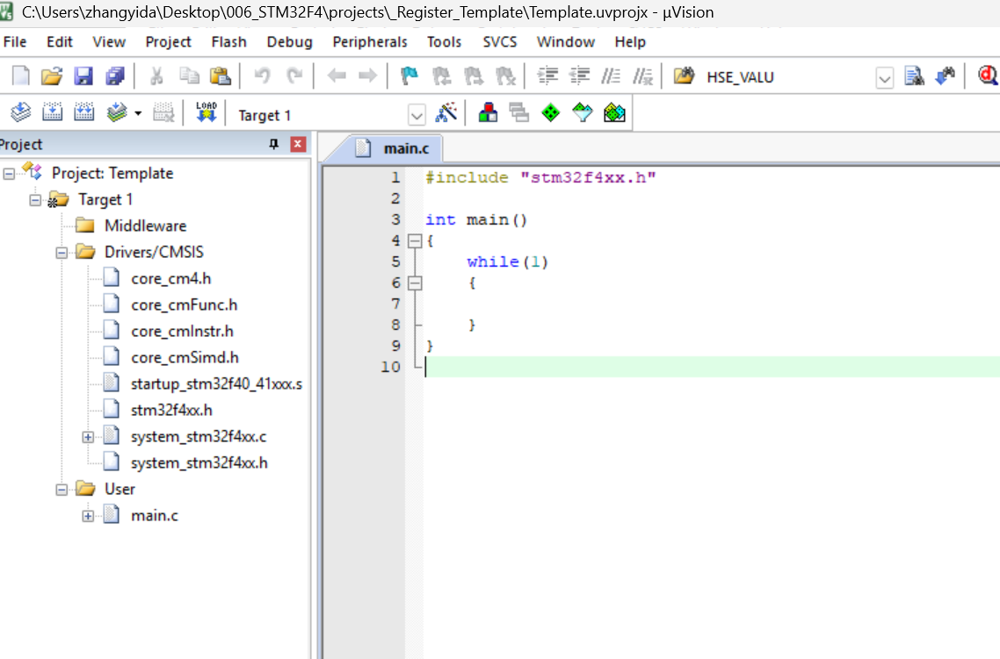
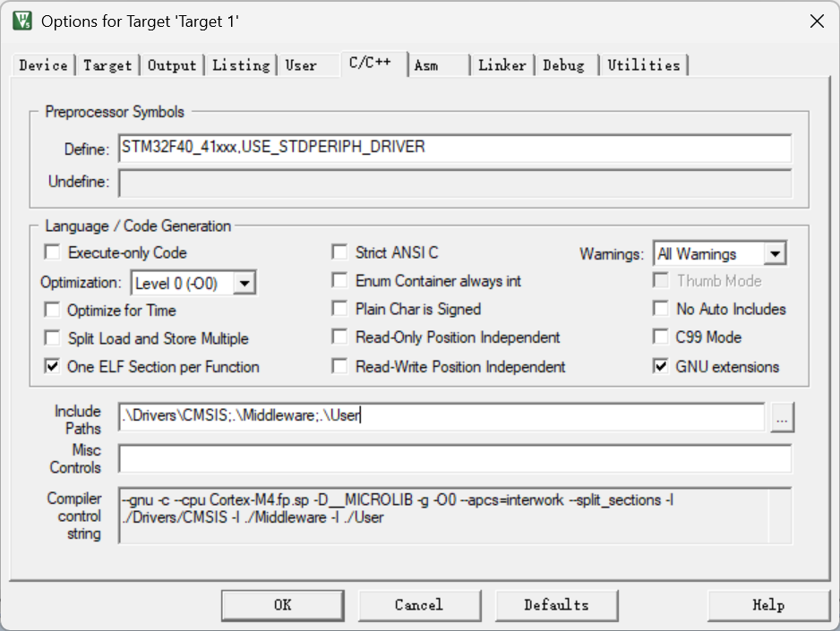
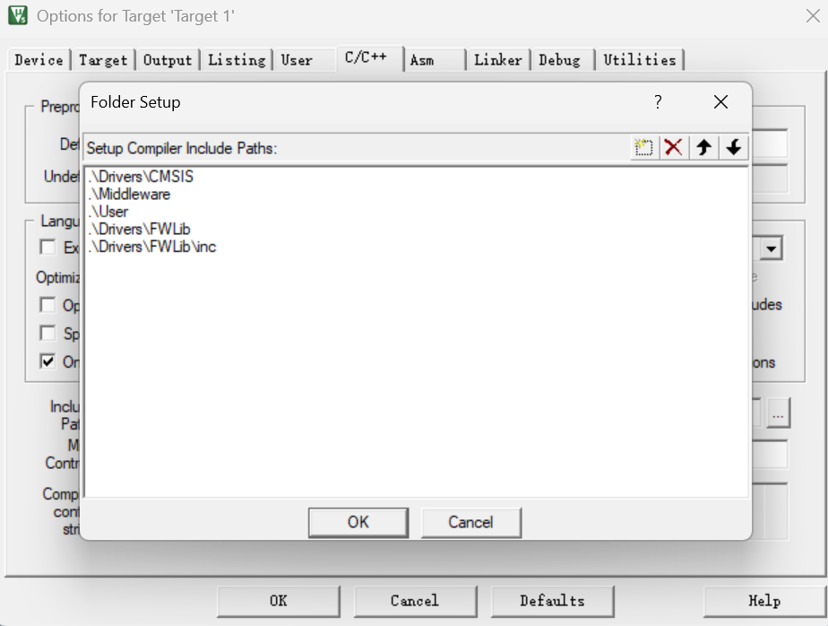
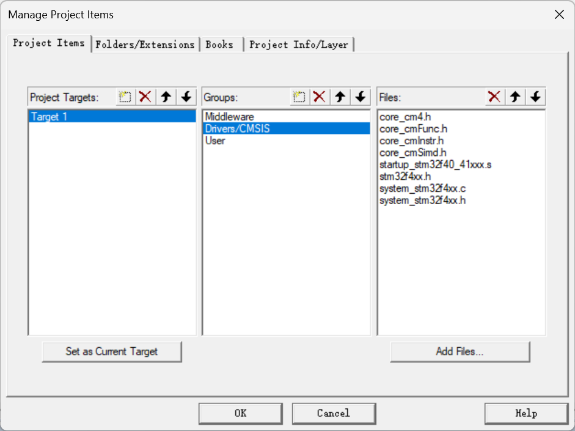
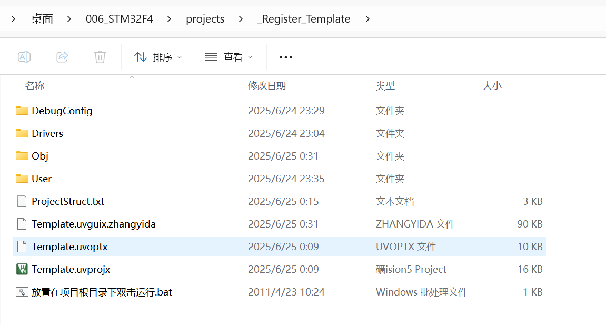
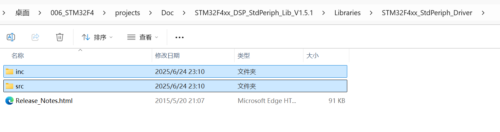
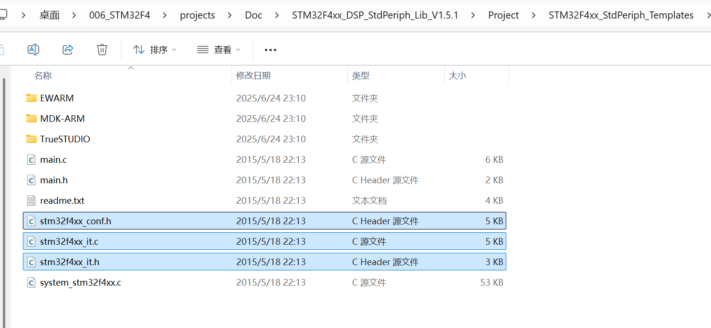
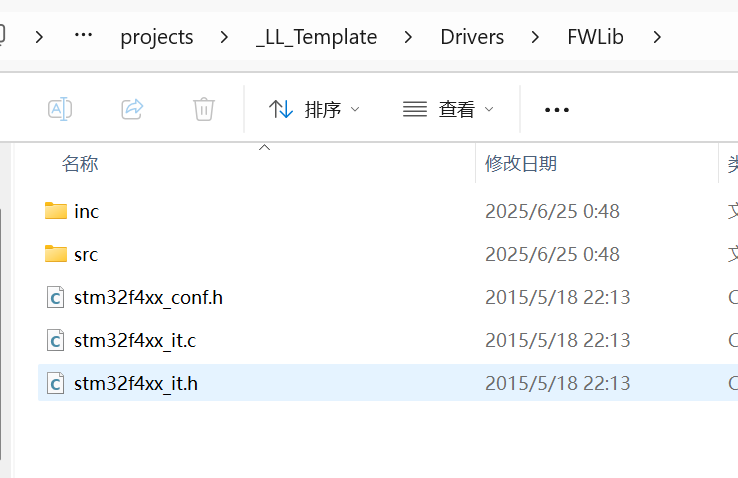

/*
Register_Template 包含创建寄存器模板的必需文件和代码,，双0。

================  创建寄存器模板工程重点说明 ======================

C/C++-Define:
STM32F40_41xxx,USE_STDPERIPH_DRIVER

* STM32F40_41xxx表示我使用了此文件所支持的芯片
* USE_STDPERIPH_DRIVER表示我使用了标准库
源代码:
#ifdef USE_STDPERIPH_DRIVER
  #include "stm32f4xx_conf.h"

扳手工具: 字体选择UTF-8

细节:
* 外部高速时钟HSE_VALUE 数值修改为8000000 即8MHz(stm32f4xx.h  128行)
* main.c仅包含的头文件：#include "stm32f4xx.h"
* 
*/

├─ DebugConfig/
│   └──↳ Target_1_STM32F407ZGTx.dbgconf
│       └── 调试配置文件，用于配置STM32F407ZGTx微控制器的调试参数，包含调试器连接设置、内存映射和断点配置等信息。
│
├─ Drivers/
│   ├─ BSP/
│   │   └──↳ （目录）
│   │       └── 板级支持包，包含与特定开发板相关的硬件驱动和初始化代码，如LED、按键、显示屏等外设的驱动。
│   │
│   ├─ CMSIS/ 必需的 8 个文件
│   │   ├──↳ core_cm4.h
│   │   │   └── Cortex-M4内核的核心头文件，定义了内核寄存器结构、中断向量表和内核功能函数。
│   │   ├──↳ core_cmFunc.h
│   │   │   └── Cortex-M4内核的辅助函数头文件，提供了操作内核寄存器的内联函数。
│   │   ├──↳ core_cmInstr.h
│   │   │   └── Cortex-M4内核的指令集头文件，包含了访问特殊寄存器和执行特权操作的函数。
│   │   ├──↳ core_cmSimd.h
│   │   │   └── Cortex-M4内核的SIMD(单指令多数据)指令头文件，支持DSP和浮点运算加速。
│   │   ├──↳ startup_stm32f40_41xxx.s
│   │   │   └── 启动文件，包含STM32F40/41系列微控制器的启动代码，负责初始化堆栈、设置中断向量表和跳转到main函数。
│   │   ├──↳ stm32f4xx.h
│   │   │   └── STM32F4系列微控制器的主头文件，包含所有外设寄存器的定义和内存映射。
│   │   └──↳ system_stm32f4xx.c/h
│   │       └── 系统初始化源文件/头文件，包含系统时钟配置和外设时钟使能函数。
│   │
│   ├─ FWLib/
│   │   └──↳ （目录）
│   │       └── 标准外设库，包含STM32F4系列微控制器的外设驱动库代码。
│   │
│   └─ SYS/
│       └──↳ （目录）
│           └── 系统相关代码，包含低功耗管理、时钟配置和系统服务等功能。
│
├─ Obj/
│   └──↳ Template.hex
│       └── 编译生成的十六进制文件，包含可烧录到STM32F407ZGTx微控制器的程序代码。
│
├─ Middleware/
│   └──↳ （目录）
│       └── 中间件目录，用于存放第三方功能组件或协议栈，例如：
│           ▶ 通信协议栈（如LWIP网络协议、FreeModbus）
│           ▶ 图形界面库（如emWin、TouchGFX）
│           ▶ 实时操作系统（如FreeRTOS、uCOS-III）
│           ▶ 文件系统（如FatFS）
│           ▶ 安全加密库或传感器驱动中间件
│
├── ProjectStruct.txt
│   └── 项目结构说明文件，记录项目的目录结构和文件组织方式。
│
└─ User/
    └──↳ main.c
        └── 主程序源文件，包含程序入口点main函数和应用程序的核心逻辑。

# 如果要在寄存器模板基础上创建标准库
将三个文件和两个文件夹放在FWLib文件夹下

编译报错,某些芯片不支持FMC和FSMC,去工程里移除它们FMC.c和FSMC.c
删去#include "main.h"
双0,完成.
