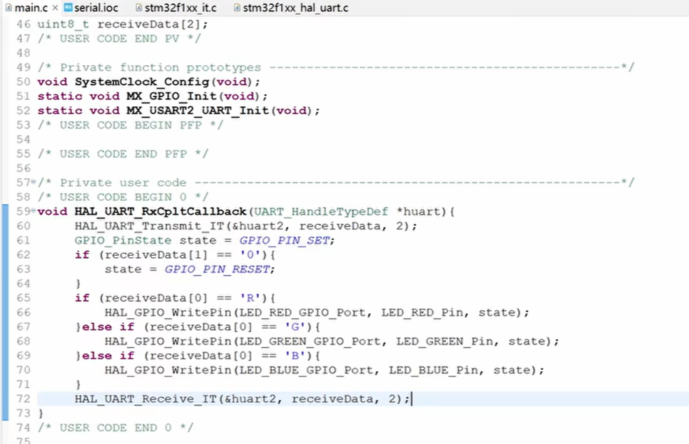

# 基本GPIO
LED0 PF9
LED1 PF10

Key_0 PE4 上拉输入
Key_1 PE3 上拉输入
Key_2 PE2 上拉输入
Key_WK_UP PA0 下拉输入

USB串口: ***UART1测试不可用***
USART1_TX PA9
USART1_RX PA10

USART2_TX PA2
USART2_RX PA3

Beep PF8
# SWD下载方式：
SWDIO PA13
SWCLK PA14

# 基本配置
#ifndef __USER_H
	#define __USER_H
	#include "stm32f4xx_hal.h"
	#include <stdio.h>
	#include <stdlib.h>
	#include <string.h>
	#include <math.h>
	#include <stdio.h>

#endif

# GPIO

施密特触发器: 将高于高参考电压的输入定义为3.3v, 将低于低参考电压的电压定义为低电平0V

四种输入: 上拉输入 下拉输入 浮空输入 模拟输入
上拉输入情况,引脚内部接上拉电阻, 默认输入高电平,下拉输入则相反

四种输出: 推挽输出 开漏输出 复用推挽输出 复用开漏输出

250925_interrupt项目,基本实现按键和LED的控制,注意需要防抖

# interrupt 中断

F103C8T6有19个外部中断线
:
先比较抢占优先级, **优先级数字越小,优先级越高**, 抢占优先级相同的前提下, 响应优先级数字小的先执行, 如果抢占优先级响应优先级均相同,则看中断向量表中的顺序(应避免这种情况发生)
在中断时发生了另一中断, 只有当后来的中断优先级更高时才会执行后来的中断,否则等前一中断执行完毕, 再执行后来的中断

嘀嗒定时器优先级须高于其他中断优先级,保证HAL_Delay()函数的正常运行而不发生程序跑飞

# UART
关注以下几个函数:
HAL_StatusTypeDef HAL_UART_Transmit(UART_HandleTypeDef *huart, const uint8_t *pData, uint16_t Size, uint32_t Timeout)	发送数据
HAL_StatusTypeDef HAL_UART_Receive(UART_HandleTypeDef *huart, uint8_t *pData, uint16_t Size, uint32_t Timeout)			接收数据
HAL_StatusTypeDef HAL_UART_Receive_IT(UART_HandleTypeDef *huart, uint8_t *pData, uint16_t Size)							发送数据(中断方式 需要在CubeMX中勾选中断)
void HAL_UART_RxCpltCallback(UART_HandleTypeDef *huart) 										接收完成回调函数 函数实现必须在最后一句加上HAL_UART_Receive_IT(huart, aRxBuffer, RXBUFFERSIZE); 以便再次接收数据

## 接收不定长数据

## 使用DMA替代CPU搬运数据
示例代码:mian.c
/* USER CODE BEGIN PV */

char TX_Message[] = "111";
uint8_t RX_Message[2];

/* USER CODE END PV */

/* Private function prototypes -----------------------------------------------*/
void SystemClock_Config(void);
static void MX_GPIO_Init(void);
static void MX_DMA_Init(void);
static void MX_USART3_UART_Init(void);
/* USER CODE BEGIN PFP */

/* USER CODE END PFP */

/* Private user code ---------------------------------------------------------*/
/* USER CODE BEGIN 0 */
void HAL_UART_RxCpltCallback(UART_HandleTypeDef *huart)
{
	HAL_UART_Transmit_DMA(&huart3, RX_Message, 2);// 回传收到的数据
	if(RX_Message[0] == 'R')
	{
	  HAL_GPIO_WritePin(GPIOA, GPIO_PIN_2, RX_Message[1] == '1' ? GPIO_PIN_RESET : GPIO_PIN_SET);
	  HAL_GPIO_WritePin(GPIOA, GPIO_PIN_15, GPIO_PIN_SET);
	  HAL_GPIO_WritePin(GPIOB, GPIO_PIN_3, GPIO_PIN_SET);
	}
	else if(RX_Message[0] == 'G')
	{
	  HAL_GPIO_WritePin(GPIOA, GPIO_PIN_15, RX_Message[1] == '1' ? GPIO_PIN_RESET : GPIO_PIN_SET);
	  HAL_GPIO_WritePin(GPIOA, GPIO_PIN_2, GPIO_PIN_SET);
	  HAL_GPIO_WritePin(GPIOB, s, GPIO_PIN_SET);
	}
	else if(RX_Message[0] == 'B')
	{
	  HAL_GPIO_WritePin(GPIOB, GPIO_PIN_3, RX_Message[1] == '1' ? GPIO_PIN_RESET : GPIO_PIN_SET);
	  HAL_GPIO_WritePin(GPIOA, GPIO_PIN_2|GPIO_PIN_15, GPIO_PIN_SET);
	}
	HAL_UART_Receive_DMA(&huart3, RX_Message, 2);// 重新开启DMA接收
}
/* USER CODE END 0 */

/**
  * @brief  The application entry point.
  * @retval int
  */
int main(void)
{

  /* USER CODE BEGIN 1 */
  /* USER CODE END 1 */

  /* MCU Configuration--------------------------------------------------------*/

  /* Reset of all peripherals, Initializes the Flash interface and the Systick. */
  HAL_Init();

  /* USER CODE BEGIN Init */
  /* USER CODE END Init */

  /* Configure the system clock */
  SystemClock_Config();

  /* USER CODE BEGIN SysInit */
  /* USER CODE END SysInit */

  /* Initialize all configured peripherals */
  MX_GPIO_Init();
  MX_DMA_Init();
  MX_USART3_UART_Init();
  /* USER CODE BEGIN 2 */
  HAL_UART_Receive_DMA(&huart3, RX_Message, 2);// 开启DMA接收

  /* USER CODE END 2 */

  /* Infinite loop */
  /* USER CODE BEGIN WHILE */
  while (1)
  {}

## 蓝牙模块实现串口数据包解析

# IIC

# Systick

# TIM

# PWM

# ADC　DAC

# RTC

# DMA 简要了解

