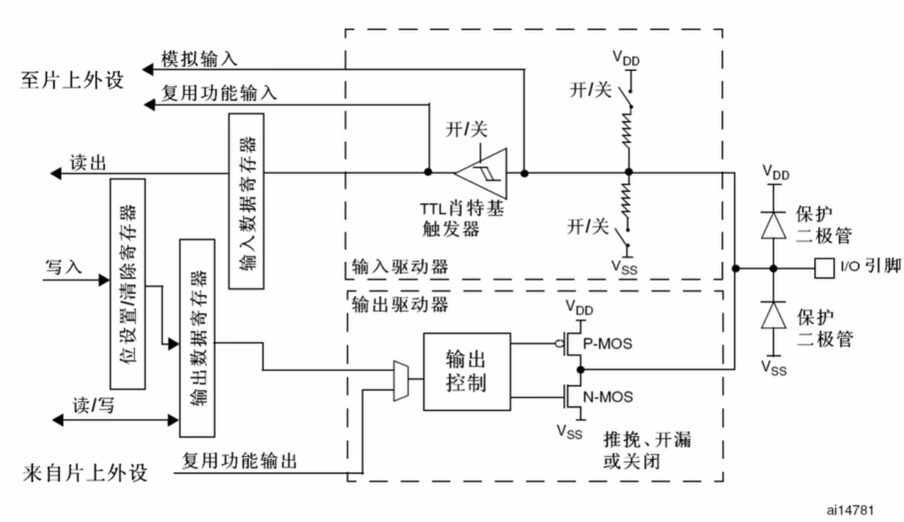
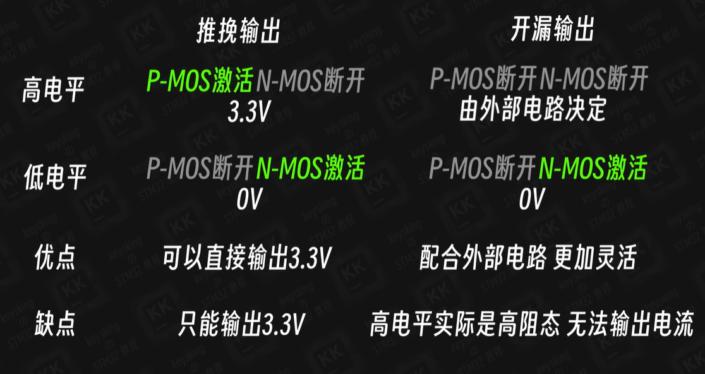
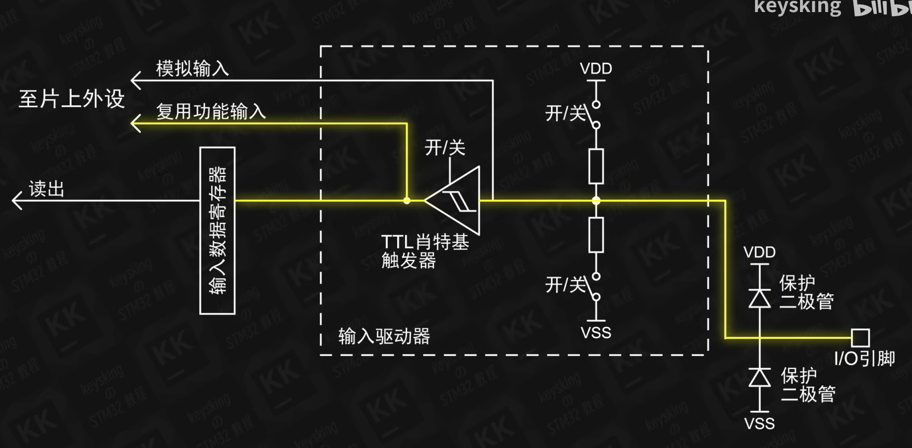
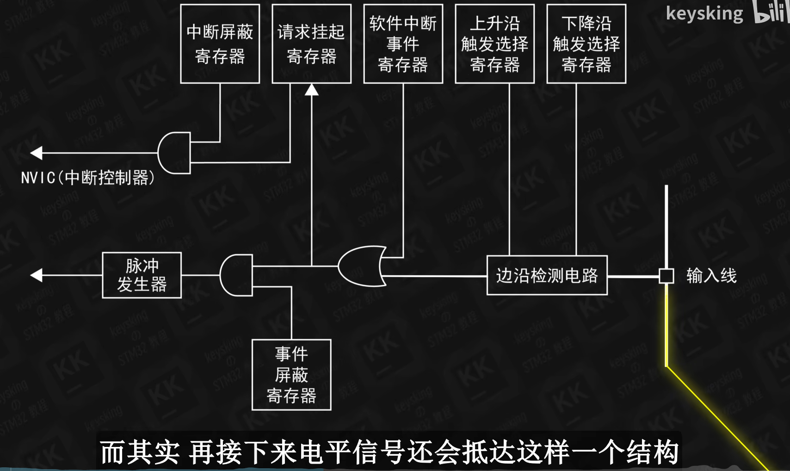
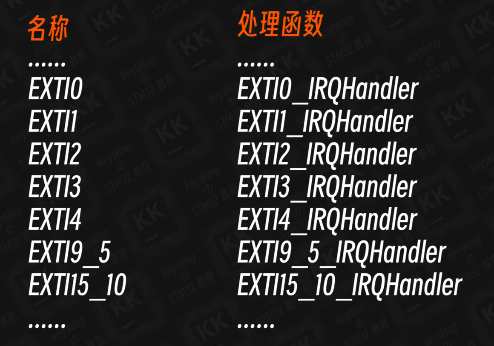
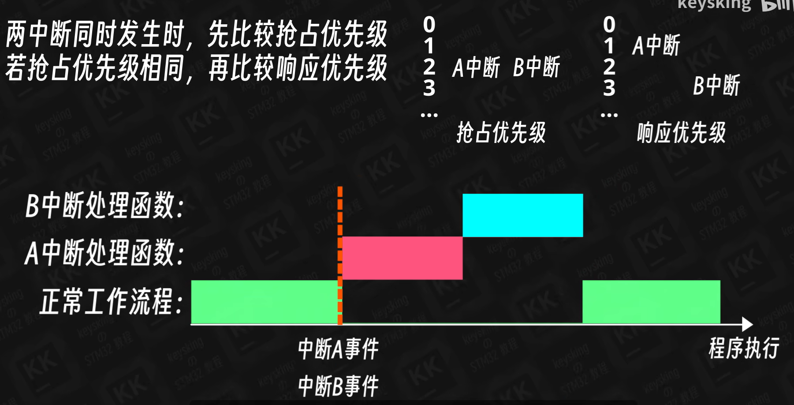
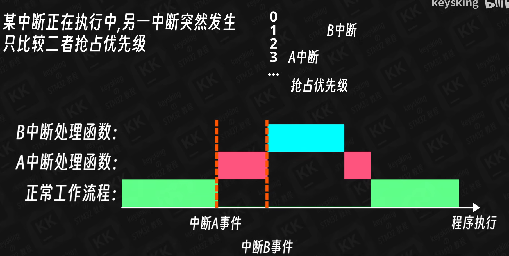

# 基本GPIO
LED0 PF9
LED1 PF10

Key_0 PE4
Key_1 PE3
Key_2 PE2
Key_WK_UP PA0 中断方式触发

Beep PF8

# 基本配置
#ifndef __USER_H
	#define __USER_H
	#include "stm32f4xx_hal.h"
	#include <stdio.h>
	#include <stdlib.h>
	#include <string.h>
	#include <math.h>
	#include <stdio.h>

#endif

# GPIO

施密特触发器: 将高于高参考电压的输入定义为3.3v, 将低于低参考电压的电压定义为低电平0V

四种输入: 上拉输入 下拉输入 浮空输入 模拟输入
上拉输入情况,引脚内部接上拉电阻, 默认输入高电平,下拉输入则相反

四种输出: 推挽输出 开漏输出 复用推挽输出 复用开漏输出

# interrupt 中断

F103C8T6有19个外部中断线
:
先比较抢占优先级, **优先级数字越小,优先级越高**, 抢占优先级相同的前提下, 响应优先级数字小的先执行, 如果抢占优先级响应优先级均相同,则看中断向量表中的顺序(应避免这种情况发生)
在中断时发生了另一中断, 只有当后来的中断优先级更高时才会执行后来的中断,否则等前一中断执行完毕, 再执行后来的中断

嘀嗒定时器优先级须高于其他中断优先级,保证HAL_Delay()函数的正常运行而不发生程序跑飞

# UART

# IIC

# Systick

# TIM

# PWM

# ADC　DAC

# RTC

# DMA 简要了解

